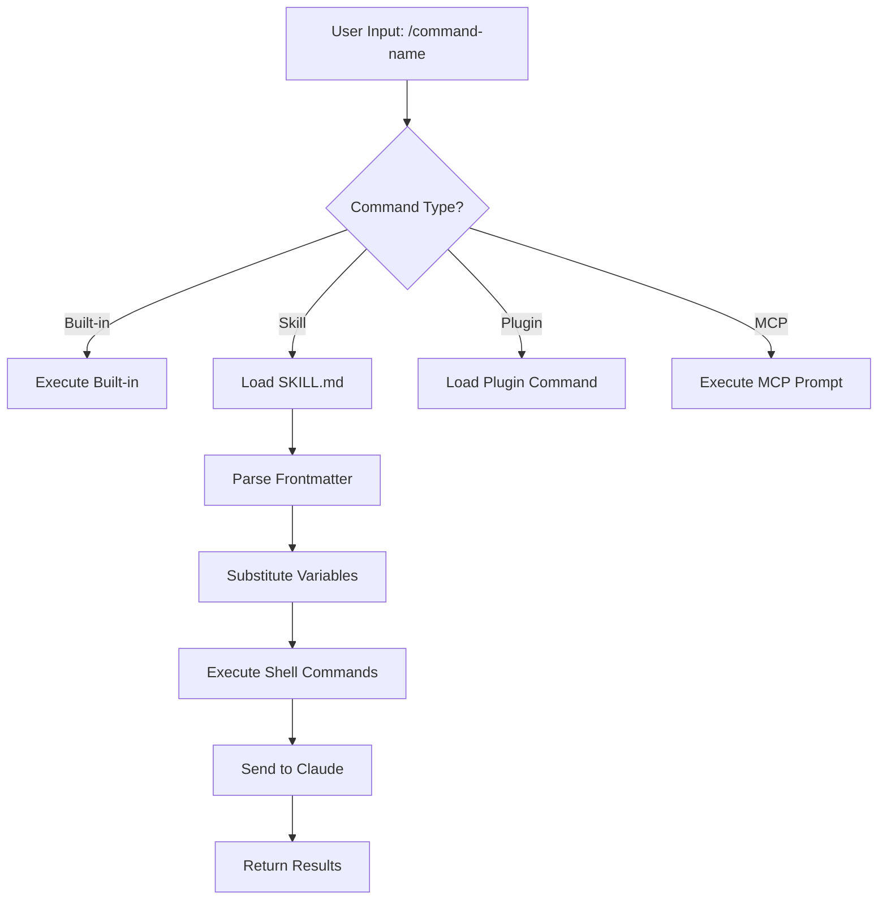
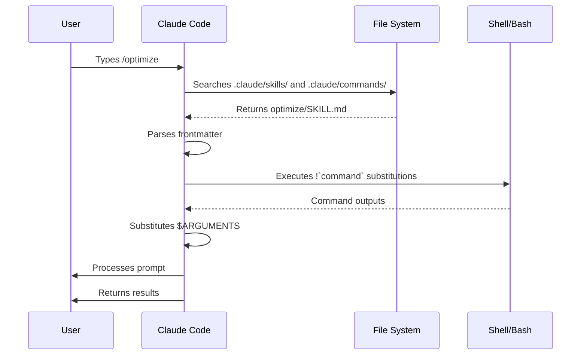

<picture>
  <source media="(prefers-color-scheme: dark)" srcset="../resources/logos/claude-howto-logo-dark.svg">
  
</picture>

# 斜杠命令

## 概述

斜杠命令是在交互式会话中控制 Claude 行为的快捷方式。它们分为以下几种类型：

- **内置命令**：由 Claude Code 提供（如 `/help`、`/clear`、`/model`）
- **Skills**：以 `SKILL.md` 文件形式创建的用户自定义命令（如 `/optimize`、`/pr`）
- **插件命令**：来自已安装插件的命令（如 `/frontend-design:frontend-design`）
- **MCP 提示词**：来自 MCP 服务器的命令（如 `/mcp__github__list_prs`）

> **注意**：自定义斜杠命令已合并至 skills 体系中。`.claude/commands/` 目录下的文件仍然有效，但推荐使用 skills （`.claude/skills/`）的方式。二者均可通过 `/command-name` 形式快速调用。完整参考请查阅 Skills 章节。

## 内置命令参考

内置命令是常用操作的快捷方式。
Claude Code 提供了 60 多个内置命令 和 5 个内置技能。
在 Claude Code 中输入 `/` 可查看完整列表，或输入 `/` 后跟字母进行筛选。

| 命令 | 用途 |
|---------|---------|
| `/add-dir <path>` | 添加工作目录 |
| `/agents` | 管理 agent 智能体配置 |
| `/branch [name]` | 将会话分支到新会话（别名：`/fork`）。注意：`/fork` 在 v2.1.77 中已重命名为 `/branch` |
| `/btw <question>` | 提出附带问题，不加入历史记录 |
| `/chrome` | 配置 Chrome 浏览器集成 |
| `/clear` | 清空对话（别名：`/reset`、`/new`） |
| `/color [color\|default]` | 设置提示栏颜色 |
| `/compact [instructions]` | 压缩对话并可选带重点说明 |
| `/config` | 打开设置（别名：`/settings`） |
| `/context` | 以彩色网格形式可视化上下文使用情况 |
| `/copy [N]` | 复制助手回复到剪贴板；`w` 表示写入文件 |
| `/cost` | 显示 token 用量统计 |
| `/desktop` | 在桌面应用中继续（别名：`/app`） |
| `/diff` | 交互式差异查看器，用于未提交的更改 |
| `/doctor` | 诊断安装健康状况 |
| `/effort [low\|medium\|high\|max\|auto]` | 设置工作强度级别。`max` 需使用 Opus 4.6 |
| `/exit` | 退出 REPL（别名：`/quit`） |
| `/export [filename]` | 将当前对话导出到文件或剪贴板 |
| `/extra-usage` | 配置速率限制的额外用量 |
| `/fast [on\|off]` | 切换快速模式 |
| `/feedback` | 提交反馈（别名：`/bug`） |
| `/help` | 显示帮助 |
| `/hooks` | 查看钩子配置 |
| `/ide` | 管理 IDE 集成 |
| `/init` | 初始化 `CLAUDE.md`。设置 `CLAUDE_CODE_NEW_INIT=1` 可以启用交互流程 |
| `/insights` | 生成会话分析报告 |
| `/install-github-app` | 设置 GitHub Actions 应用 |
| `/install-slack-app` | 安装 Slack 应用 |
| `/keybindings` | 打开按键绑定配置 |
| `/login` | 切换 Anthropic 账户 |
| `/logout` | 退出 Anthropic 账户登录 |
| `/mcp` | 管理 MCP 服务器及 OAuth |
| `/memory` | 编辑 `CLAUDE.md`，切换自动记忆 |
| `/mobile` | 显示移动端应用二维码（别名：`/ios`、`/android`） |
| `/model [model]` | 选择模型，可使用左右箭头调整模型工作强度 |
| `/passes` | 分享 Claude Code 免费试用周 |
| `/permissions` | 查看/更新权限（别名：`/allowed-tools`） |
| `/plan [description]` | 进入计划模式 |
| `/plugin` | 管理插件 |
| `/powerup` | 通过互动教程和动画演示探索各项功能 |
| `/privacy-settings` | 隐私设置（仅 Pro/Max 用户） |
| `/release-notes` | 查看更新日志 |
| `/reload-plugins` | 重新加载已激活插件 |
| `/remote-control` | 从 claude.ai 进行远程控制（别名：`/rc`） |
| `/remote-env` | 配置默认远程环境 |
| `/rename [name]` | 重命名会话 |
| `/resume [session]` | 恢复对话（别名：`/continue`） |
| `/review` | **已弃用**，请安装 `code-review` 插件替代 |
| `/rewind` | 回退对话和/或代码（别名：`/checkpoint`） |
| `/sandbox` | 切换沙盒模式 |
| `/schedule [description]` | 创建/管理云端定时任务 |
| `/security-review` | 分析分支安全漏洞 |
| `/skills` | 列出可用技能 |
| `/stats` | 可视化每日用量、会话数、连续使用天数 |
| `/stickers` | 订购 Claude Code 贴纸 |
| `/status` | 显示版本、模型、账户信息 |
| `/statusline` | 配置状态行 |
| `/tasks` | 列出/管理后台任务 |
| `/terminal-setup` | 配置终端按键绑定 |
| `/theme` | 更改颜色主题 |
| `/ultraplan <prompt>` | 在 ultraplan 会话中起草计划，并在浏览器中审查 |
| `/upgrade` | 打开升级页面以升至更高级别套餐 |
| `/usage` | 显示套餐用量限制及速率限制状态 |
| `/voice` | 切换按下说话语音输入功能 |

### 内置 Skills

这些技能随 Claude Code 一同提供，可像斜杠命令一样调用：

| 技能 | 用途 |
|-------|---------|
| `/batch <instruction>` | 使用工作树编排大规模并行更改 |
| `/claude-api` | 为项目语言加载 Claude API 参考文档 |
| `/debug [description]` | 启用调试日志记录 |
| `/loop [interval] <prompt>` | 按指定间隔重复运行提示 |
| `/simplify [focus]` | 审查已更改文件的代码质量 |

### 已弃用的命令

| 命令 | 状态 |
|---------|--------|
| `/review` | 已弃用，由 `code-review` 插件替代 |
| `/output-style` | 自 v2.1.73 起已弃用 |
| `/fork` | 已重命名为 `/branch`（别名仍有效，v2.1.77） |
| `/pr-comments` | 在 v2.1.91 中移除，直接要求 Claude 查看 PR 评论 |
| `/vim` | 在 v2.1.92 中移除，请使用 `/config` 进入 `Editor mode` |

### 近期变更

- `/fork` 已重命名为 `/branch`，`/fork` 保留为别名（v2.1.77）
- `/output-style` 已弃用（v2.1.73）
- `/review` 已弃用，推荐使用 `code-review` 插件
- 新增 `/effort` 命令，其中 `max` 级别需使用 Opus 4.6
- 新增 `/voice` 命令，用于按下说话语音输入
- 新增 `/schedule` 命令，用于创建/管理定时任务
- 新增 `/color` 命令，用于自定义提示栏颜色
- `/pr-comments` 在 v2.1.91 中移除，直接要求 Claude 查看 PR 评论
- `/vim` 在 v2.1.92 中移除，请改用 `/config` 进入 `Editor mode`
- 新增 `/ultraplan`，支持基于浏览器进行计划审查与执行
- 新增 `/powerup`，提供交互式功能教学
- 新增 `/sandbox`，用于切换沙盒模式
- `/model` 选择器现显示可读标签（如 "Sonnet 4.6"），而非原始模型 ID
- `/resume` 现支持 `/continue` 别名
- MCP 提示词现可作为 `/mcp__<server>__<prompt>` 命令使用（参阅 [MCP 提示词作为命令](#mcp-prompts-as-commands)）

## 自定义命令（现已归入 Skills）

自定义斜杠命令已**合并至 Skills 体系**。
两种方式均可创建以 `/command-name` 形式调用的命令：

| 方式 | 位置 | 状态 |
|----------|----------|--------|
| Skills（推荐） | `.claude/skills/<name>/SKILL.md` | 当前标准 |
| 旧版命令 | `.claude/commands/<name>.md` | 仍可运行 |

若技能与命令名称相同，则**技能优先**。
例如，当 `.claude/commands/review.md` 与 `.claude/skills/review/SKILL.md` 同时存在时，将使用技能版本。

### 迁移路径

现有的 `.claude/commands/` 文件无需改动即可继续使用。
若要迁移至技能体系：

**迁移前（Command）：**

```
.claude/commands/optimize.md
```

**迁移后（Skill）：**

```
.claude/skills/optimize/SKILL.md
```

### 为何选择 Skills？

相比旧版命令，技能体系提供了更多功能：

- **目录结构**：可打包脚本、模板及参考文件
- **自动调用**：Claude 可在相关场景下自动触发技能
- **调用控制**：可选择由用户、Claude 或双方均可调用
- **子代理执行**：通过 `context: fork` 在隔离上下文中运行技能
- **渐进式披露**：仅按需加载额外文件

### 以技能形式创建自定义命令

创建一个包含 `SKILL.md` 文件的目录：

```bash
mkdir -p .claude/skills/my-command
```

**文件：** `.claude/skills/my-command/SKILL.md`

```yaml
---
name: my-command
description: What this command does and when to use it
---

# My Command

Instructions for Claude to follow when this command is invoked.

1. First step
2. Second step
3. Third step
```

### Frontmatter 前言元数据参考

| 字段 | 用途 | 默认值 |
|-------|---------|---------|
| `name` | 命令名称（将成为 `/name`） | 目录名 |
| `description` | 简要描述（帮助 Claude 判断何时使用） | 第一段内容 |
| `argument-hint` | 自动补全所需的预期参数 | 无 |
| `allowed-tools` | 命令无需权限即可使用的工具 | 继承 |
| `model` | 指定使用的模型 | 继承 |
| `disable-model-invocation` | 若为 `true`，仅用户可调用（Claude 不可调用） | `false` |
| `user-invocable` | 若为 `false`，从 `/` 菜单中隐藏 | `true` |
| `context` | 设为 `fork` 则在隔离子代理中运行 | 无 |
| `agent` | 使用 `context: fork` 时的代理类型 | `general-purpose` |
| `hooks` | 技能作用域内的钩子（PreToolUse、PostToolUse、Stop） | 无 |

### 参数

命令可以接收参数：

**使用 `$ARGUMENTS` 接收全部参数：**

```yaml
---
name: fix-issue
description: Fix a GitHub issue by number
---

Fix issue #$ARGUMENTS following our coding standards
```

用法：`/fix-issue 123` → `$ARGUMENTS` 变为 "123"

**使用 `$0`、`$1` 等接收单个参数：**

```yaml
---
name: review-pr
description: Review a PR with priority
---

Review PR #$0 with priority $1
```
用法：`/review-pr 456 high` → `$0`="456"，`$1`="high"

### 使用 Shell 命令注入动态上下文

通过 !`command` 语法可在生成提示词前执行 Bash 命令：

```yaml
---
name: commit
description: Create a git commit with context
allowed-tools: Bash(git *)
---

## Context

- Current git status: !`git status`
- Current git diff: !`git diff HEAD`
- Current branch: !`git branch --show-current`
- Recent commits: !`git log --oneline -5`

## Your task

Based on the above changes, create a single git commit.
```

### 文件引用

使用 `@` 语法引入文件内容：

```markdown
Review the implementation in @src/utils/helpers.js
Compare @src/old-version.js with @src/new-version.js
```
## 插件命令

插件可以提供自定义命令：

```
/plugin-name:command-name
```

若不存在命名冲突，也可直接使用 `/command-name`。

**示例:**

```bash
/frontend-design:frontend-design
/commit-commands:commit
```

## MCP 提示词作为命令

MCP 服务器可将提示词作为斜杠命令触发：

```
/mcp__<server-name>__<prompt-name> [arguments]
```

**示例:**

```bash
/mcp__github__list_prs
/mcp__github__pr_review 456
/mcp__jira__create_issue "Bug title" high
```

### MCP 权限语法

在权限设置中控制 MCP 服务器访问：

- `mcp__github` 访问整个 GitHub MCP 服务器
- `mcp__github__*` 通配符，访问所有工具
- `mcp__github__get_issue` 仅访问特定工具

## 命令架构



## 命令生命周期



## 本文件夹中的可用命令

以下示例命令可作为技能或旧版命令安装使用。

### 1. `/optimize` 代码优化

分析代码中的性能问题、内存泄漏及优化机会。

**用法：**

```
/optimize
[Paste your code]
```

### 2. `/pr` Pull Request 准备

引导完成 PR 准备清单，包括代码检查、测试及提交信息格式化。

**用法：**

```
/pr
```

**截图：**


### 3. `/generate-api-docs` API 文档生成器

根据源代码生成完整的 API 文档。

**用法：**

```
/generate-api-docs
```
### 4. `/commit` 带上下文的 Git 提交

创建一个包含仓库动态上下文的 Git 提交。

**用法：**

```
/commit [optional message]
```

### 5. `/push-all` 暂存、提交并推送

暂存所有更改、创建提交，并在进行安全检查后推送至远程仓库。

**用法：**

```
/push-all
```

**安全检查项：**

- 密钥/敏感文件：`.env*`、`*.key`、`*.pem`、`credentials.json`
- API 密钥：检测真实密钥与占位符的区别
- 大文件：未使用 Git LFS 且超过 `10MB` 的文件
- 构建产物：`node_modules/`、`dist/`、`__pycache__/`

### 6. `/doc-refactor` 文档重构

重新整理项目文档，以提升清晰度与可访问性。

**用法：**

```
/doc-refactor
```
### 7. `/setup-ci-cd` CI/CD 流水线设置

配置预提交 hooks 与 GitHub Actions 以确保代码质量。

**用法：**

```
/setup-ci-cd
```

### 8. `/unit-test-expand` 测试覆盖率扩展

通过针对未测试分支及边缘情况，提升测试覆盖率。

**用法：**

```
/unit-test-expand
```

## 安装

### 作为技能安装（推荐）

复制到你的技能目录：

```bash
# Create skills directory
mkdir -p .claude/skills

# For each command file, create a skill directory
for cmd in optimize pr commit; do
  mkdir -p .claude/skills/$cmd
  cp 01-slash-commands/$cmd.md .claude/skills/$cmd/SKILL.md
done
```

### 作为旧版命令安装

复制到你的命令目录：

```bash
# Project-wide (team)
mkdir -p .claude/commands
cp 01-slash-commands/*.md .claude/commands/

# Personal use
mkdir -p ~/.claude/commands
cp 01-slash-commands/*.md ~/.claude/commands/
```
## 创建自己的命令

### 技能模板（推荐）

创建 `.claude/skills/my-command/SKILL.md`:

```yaml
---
name: my-command
description: What this command does. Use when [trigger conditions].
argument-hint: [optional-args]
allowed-tools: Bash(npm *), Read, Grep
---

# Command Title

## Context

- Current branch: !`git branch --show-current`
- Related files: @package.json

## Instructions

1. First step
2. Second step with argument: $ARGUMENTS
3. Third step

## Output Format

- How to format the response
- What to include
```

### 仅限用户调用的命令（禁止 Claude 自动调用）

适用于会产生副作用且 Claude 不应自动触发的命令：

```yaml
---
name: deploy
description: Deploy to production
disable-model-invocation: true
allowed-tools: Bash(npm *), Bash(git *)
---

Deploy the application to production:

1. Run tests
2. Build application
3. Push to deployment target
4. Verify deployment
```

## 最佳实践

| 建议事项 | 避免事项 |
|------|---------|
| 使用清晰、以行动为导向的名称 | 为一次性任务创建命令 |
| 在 `description` 中包含触发条件 | 在命令中构建复杂逻辑 |
| 保持命令专注于单一任务 | 硬编码敏感信息 |
| 对有副作用的命令使用 `disable-model-invocation` | 跳过描述字段 |
| 使用 `!` 前缀注入动态上下文 | 假设 Claude 了解当前状态 |
| 在技能目录中整理相关文件 | 将所有内容塞进单个文件 |

## 故障排查

### 命令未找到

**解决方法：**

- 检查文件是否位于 `.claude/skills/<name>/SKILL.md` 或 `.claude/commands/<name>.md`
- 确认前言元数据中的 `name` 字段与预期的命令名称一致
- 重启 Claude Code 会话
- 运行 `/help` 查看可用命令列表

### 命令未按预期执行

**解决方法：**

- 添加更具体的指令说明
- 在技能文件中包含示例用法
- 若使用了 bash 命令，请检查 `allowed-tools` 权限配置
- 先使用简单输入进行测试

### Skill vs Command 冲突

若同名文件同时存在，**技能将优先使用**。
请删除其中之一或将其重命名。

## 相关指南

- **[Skills](../03-skills/)** - Full reference for skills (auto-invoked capabilities)
- **[Memory](../02-memory/)** - Persistent context with CLAUDE.md
- **[Subagents](../04-subagents/)** - Delegated AI agents
- **[Plugins](../07-plugins/)** - Bundled command collections
- **[Hooks](../06-hooks/)** - Event-driven automation

## 其他资源

- [Official Interactive Mode Documentation](https://code.claude.com/docs/en/interactive-mode) - Built-in commands reference
- [Official Skills Documentation](https://code.claude.com/docs/en/skills) - Complete skills reference
- [CLI Reference](https://code.claude.com/docs/en/cli-reference) - Command-line options

---
**Last Updated**: April 2026
**Claude Code Version**: 2.1+
**Compatible Models**: Claude Sonnet 4.6, Claude Opus 4.6, Claude Haiku 4.5

*Part of the [Claude How To](../) guide series*
