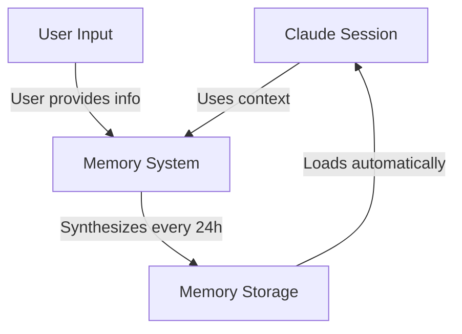
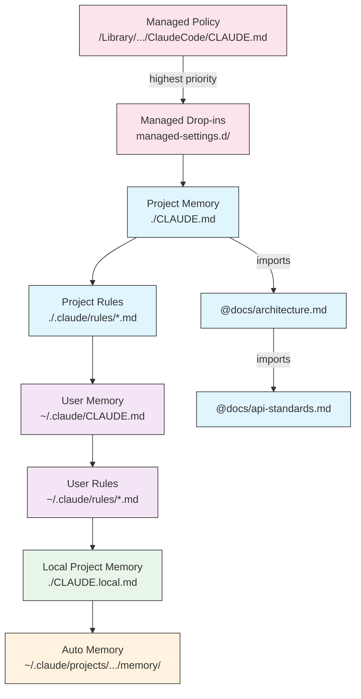
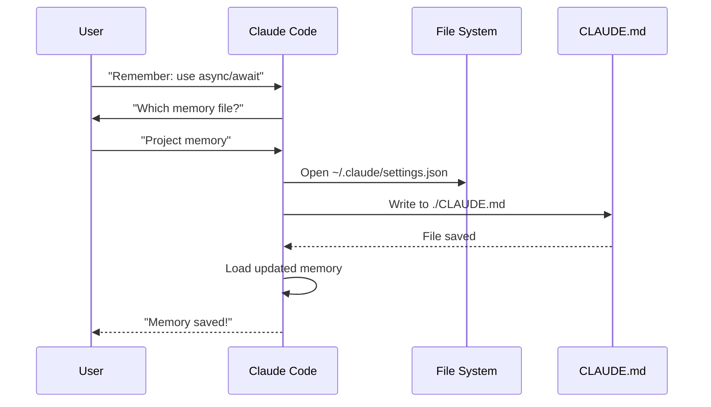
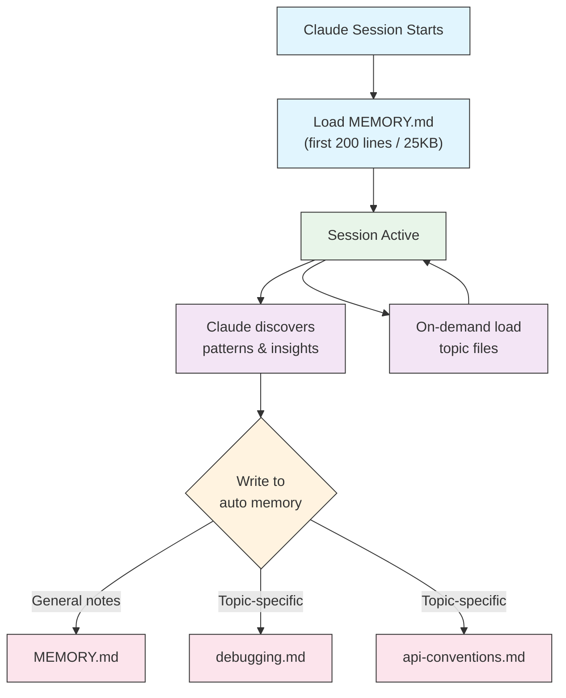

<picture>
  <source media="(prefers-color-scheme: dark)" srcset="../resources/logos/claude-howto-logo-dark.svg">
  
</picture>

# Memory 记忆功能指南

Memory 记忆功能使 Claude 能够在不同会话与对话之间保留上下文信息。
它有两种实现形式：claude.ai 中的自动合成记忆，以及 Claude Code 中基于文件系统的 CLAUDE.md 记忆。

## 概述

Claude Code 中的记忆功能可在多个会话与对话之间提供持久化上下文。
与临时的上下文窗口不同，记忆文件允许你：

- 与团队共享项目规范标准
- 存储个人开发偏好
- 维护目录级别的特定规则与配置
- 导入外部文档
- 将记忆作为项目的一部分进行版本控制

记忆系统在多个层级上运行，从全局个人偏好到具体子目录，让你能够精细地控制 Claude 记住的内容及其应用这些知识的方式。

## 记忆功能命令快速参考

| 命令 | 用途 | 用法 | 适用场景 |
|---------|---------|-------|-------------|
| `/init` | 初始化项目记忆 | `/init` | 启动新项目、首次设置 CLAUDE.md 时 |
| `/memory` | 在编辑器中编辑记忆文件 | `/memory` | 大量更新、重新整理内容、查阅现有记忆时 |
| `#` 前缀 | 快速添加单行记忆 | `# 添加的单行规则内容` | 通过对话快速添加规则时 |
| `# new rule into memory` | 明确添加记忆 | `# new rule into memory<br/>详细规则内容` | 添加复杂的多行规则时 |
| `# remember this` | 自然语言记忆 | `# remember this<br/>添加的指令内容` | 以对话方式更新记忆时 |
| `@path/to/file` | 导入外部内容 | `@README.md` 或 `@docs/api.md` | 在 CLAUDE.md 中引用已有文档时 |

## 快速开始：初始化记忆 Memory

### `/init` 命令

`/init` 命令是在 Claude Code 中设置项目记忆的最快方式。
它会创建一个包含基础项目文档的 CLAUDE.md 文件。

**用法：**

```bash
/init
```

**功能说明：**

- 在项目中创建新的 CLAUDE.md 文件（通常位于 `./CLAUDE.md` 或 `./.claude/CLAUDE.md`）
- 确立项目规范与指导原则
- 为跨会话的上下文持久化奠定基础
- 提供记录项目标准的模板结构

**增强交互模式：** 设置 `CLAUDE_CODE_NEW_INIT=1` 可启用多阶段交互流程，逐步引导你完成项目设置：

```bash
CLAUDE_CODE_NEW_INIT=1 claude
/init
```
**何时使用 `/init`：**

- 开始使用 Claude Code 参与新项目时
- 建立团队编码规范与约定时
- 创建关于代码库结构的文档时
- 为协作开发建立记忆层级体系时

**示例工作流：**

```markdown
# In your project directory
/init

# Claude creates CLAUDE.md with structure like:
# Project Configuration
## Project Overview
- Name: Your Project
- Tech Stack: [Your technologies]
- Team Size: [Number of developers]

## Development Standards
- Code style preferences
- Testing requirements
- Git workflow conventions
```
### 使用 `#` 快速更新记忆

在任何对话中，以 `#` 开头即可快速将信息添加到记忆中：

**语法：**

```markdown
# Your memory rule or instruction here
```

**示例：**

```markdown
# Always use TypeScript strict mode in this project

# Prefer async/await over promise chains

# Run npm test before every commit

# Use kebab-case for file names
```

**工作原理：**

1. 以 `#` 开头加上规则内容作为你的消息
2. Claude 将此识别为更新记忆的请求
3. Claude 询问要更新哪个记忆文件（项目或个人）
4. 规则被添加到相应的 CLAUDE.md 文件中
5. 后续会话会自动加载此上下文

**替代用法：**

```markdown
# new rule into memory
Always validate user input with Zod schemas

# remember this
Use semantic versioning for all releases

# add to memory
Database migrations must be reversible
```

### `/memory` 命令

`/memory` 命令可直接在 Claude Code 会话中编辑 CLAUDE.md 记忆文件。
它会在系统编辑器中打开记忆文件，供你进行全面编辑。

**用法：**

```bash
/memory
```

**功能说明：**

- 在系统默认编辑器中打开你的记忆文件
- 允许进行大量添加、修改和重新整理
- 可直接访问记忆层级中的所有文件
- 支持管理跨会话的持久化上下文

**何时使用 `/memory`：**

- 查看现有记忆内容时
- 对项目标准进行大规模更新时
- 重新整理记忆结构时
- 添加详细文档或指导原则时
- 随项目演进而维护和更新记忆时

**对比：`/memory` vs `/init`**

| 方面 | `/memory` | `/init` |
|--------|-----------|---------|
| 用途 | 编辑现有记忆文件 | 初始化新的 CLAUDE.md |
| 使用时机 | 更新/修改项目上下文 | 开始新项目时 |
| 操作 | 在编辑器中打开以进行修改 | 生成初始模板 |
| 工作流 | 持续性维护 | 一次性设置 |

**示例工作流：**

```markdown
# Open memory for editing
/memory

# Claude presents options:
# 1. Managed Policy Memory
# 2. Project Memory (./CLAUDE.md)
# 3. User Memory (~/.claude/CLAUDE.md)
# 4. Local Project Memory

# Choose option 2 (Project Memory)
# Your default editor opens with ./CLAUDE.md content

# Make changes, save, and close editor
# Claude automatically reloads the updated memory
```

**使用记忆导入功能：**

CLAUDE.md 文件支持 `@path/to/file` 语法来包含外部内容：

```markdown
# Project Documentation
See @README.md for project overview
See @package.json for available npm commands
See @docs/architecture.md for system design

# Import from home directory using absolute path
@~/.claude/my-project-instructions.md
```

**导入功能特性：**

- 支持相对路径和绝对路径（例如 `@docs/api.md` 或 `@~/.claude/my-project-instructions.md`）
- 支持递归导入，最大深度为 5 层
- 首次从外部位置导入时会触发安全审批对话框
- 导入指令不会在 Markdown 代码段或代码块内被解析（因此在示例中安全地记录它们是没问题的）
- 通过引用现有文档避免内容重复
- 自动将引用的内容纳入 Claude 的上下文

## 记忆架构

Claude Code 中的记忆遵循一套层级体系，不同作用域各司其职：



## Claude Code 中的记忆层级

Claude Code 采用多层级的记忆体系。
记忆文件在 Claude Code 启动时自动加载，层级越高的文件优先级越高。

**完整记忆层级（按优先级从高到低排列）：**

1. **托管策略** - 组织范围的指令
   - macOS：`/Library/Application Support/ClaudeCode/CLAUDE.md`
   - Linux/WSL：`/etc/claude-code/CLAUDE.md`
   - Windows：`C:\Program Files\ClaudeCode\CLAUDE.md`

2. **托管策略附加文件** - 按字母顺序合并的策略文件（v2.1.83 及以上版本）
   - 位于托管策略 CLAUDE.md 同级目录下的 `managed-settings.d/` 目录
   - 文件按字母顺序合并，实现模块化策略管理

3. **项目记忆** - 团队共享的上下文（纳入版本控制）
   - `./.claude/CLAUDE.md` 或 `./CLAUDE.md`（位于仓库根目录）

4. **项目规则** - 模块化、按主题划分的项目指令
   - `./.claude/rules/*.md`

5. **用户记忆** - 个人偏好设置（适用于所有项目）
   - `~/.claude/CLAUDE.md`

6. **用户级规则** - 个人规则（适用于所有项目）
   - `~/.claude/rules/*.md`

7. **本地项目记忆** - 针对特定项目的个人偏好设置
   - `./CLAUDE.local.md`

> **注意**：`CLAUDE.local.md` 已获得完全支持，并在[官方文档](https://code.claude.com/docs/en/memory)中有详细说明。它用于存放针对特定项目的个人偏好设置，这些设置不会提交到版本控制系统。请将 `CLAUDE.local.md` 添加到 `.gitignore` 文件中。

8. **自动记忆** - Claude 自动记录的笔记与习得内容
   - `~/.claude/projects/<project>/memory/`

**记忆发现行为：**

Claude 按以下顺序搜索记忆文件，位置越靠前者优先级越高：



## 使用 `claudeMdExcludes` 排除 CLAUDE.md 文件

在大型单一代码仓库（monorepo）中，某些 CLAUDE.md 文件可能与你当前的工作无关。
`claudeMdExcludes` 设置允许你跳过特定的 CLAUDE.md 文件，使其不被加载到上下文中：

```jsonc
// In ~/.claude/settings.json or .claude/settings.json
{
  "claudeMdExcludes": [
    "packages/legacy-app/CLAUDE.md",
    "vendors/**/CLAUDE.md"
  ]
}
```

匹配模式基于相对于项目根目录的路径进行。这在以下场景中尤为有用：

- 包含众多子项目的单一代码仓库（monorepo），其中仅有部分项目相关
- 包含供应商或第三方提供的 CLAUDE.md 文件的仓库
- 通过排除过时或不相关的指令，减少 Claude 上下文窗口中的干扰信息

## Settings 文件的层级

Claude Code 的设置（包括 `autoMemoryDirectory`、`claudeMdExcludes` 及其他配置选项）按五级层级体系进行解析，层级越高优先级越高：

| 层级 | 位置 | 作用范围 |
|-------|----------|-------|
| 1（最高） | 托管策略（系统级） | 组织范围强制执行 |
| 2 | `managed-settings.d/`（v2.1.83 及以上版本） | 模块化策略附加文件，按字母顺序合并 |
| 3 | `~/.claude/settings.json` | 用户偏好设置 |
| 4 | `.claude/settings.json` | 项目级设置（提交至 Git） |
| 5（最低） | `.claude/settings.local.json` | 本地覆盖设置（需 git-ignored） |

**平台特定配置（v2.1.51 及以上版本）：**

Settings 设置也可通过以下方式进行配置：

- **macOS**：属性列表（plist）文件
- **Windows**：Windows 注册表

这些平台原生机制将与 JSON 设置文件一同读取，并遵循相同的优先级规则。

## 模块化规则系统

利用 `.claude/rules/` 目录结构创建有组织的、针对特定路径的规则。
规则可在项目级别和用户级别分别定义：

```
your-project/
├── .claude/
│   ├── CLAUDE.md
│   └── rules/
│       ├── code-style.md
│       ├── testing.md
│       ├── security.md
│       └── api/                  # Subdirectories supported
│           ├── conventions.md
│           └── validation.md

~/.claude/
├── CLAUDE.md
└── rules/                        # User-level rules (all projects)
    ├── personal-style.md
    └── preferred-patterns.md
```

规则会在 `rules/` 目录内递归发现，包括所有子目录。
位于 `~/.claude/rules/` 的用户级规则会先于项目级规则加载，这样个人可设定默认规则，而项目规则可对其覆盖。

### 使用 YAML Frontmatter 前言元数据定义路径特定规则

定义仅适用于特定文件路径的规则：

```markdown
---
paths: src/api/**/*.ts
---

# API Development Rules

- All API endpoints must include input validation
- Use Zod for schema validation
- Document all parameters and response types
- Include error handling for all operations
```

**Glob 模式示例：**

- `**/*.ts` - 所有 TypeScript 文件
- `src/**/*` - `src/` 目录下的所有文件
- `src/**/*.{ts,tsx}` - 匹配多种扩展名
- `{src,lib}/**/*.ts, tests/**/*.test.ts` - 多个模式

### 子目录与符号链接

`.claude/rules/` 中的规则支持两种组织方式：

- **子目录**：规则会被递归发现，因此你可按主题文件夹进行归类（例如 `rules/api/`、`rules/testing/`、`rules/security/`）
- **符号链接**：支持通过符号链接在多个项目间共享规则。例如，你可以从中心位置将共享规则文件符号链接到各项目的 `.claude/rules/` 目录中

## Memory 记忆位置表

| 位置 | 作用域 | 优先级 | 共享对象 | 访问方式 | 适用场景 |
|----------|-------|----------|--------|--------|----------|
| `/Library/Application Support/ClaudeCode/CLAUDE.md`（macOS） | 托管策略 | 1（最高） | 组织 | 系统 | 公司级策略 |
| `/etc/claude-code/CLAUDE.md`（Linux/WSL） | 托管策略 | 1（最高） | 组织 | 系统 | 组织标准规范 |
| `C:\Program Files\ClaudeCode\CLAUDE.md`（Windows） | 托管策略 | 1（最高） | 组织 | 系统 | 企业指导原则 |
| `managed-settings.d/*.md`（与策略文件同级） | 托管策略附加文件 | 1.5 | 组织 | 系统 | 模块化策略文件（v2.1.83+） |
| `./CLAUDE.md` 或 `./.claude/CLAUDE.md` | 项目记忆 | 2 | 团队 | Git | 团队标准、共享架构 |
| `./.claude/rules/*.md` | 项目规则 | 3 | 团队 | Git | 路径特定、模块化规则 |
| `~/.claude/CLAUDE.md` | 用户记忆 | 4 | 个人 | 文件系统 | 个人偏好（所有项目） |
| `~/.claude/rules/*.md` | 用户规则 | 5 | 个人 | 文件系统 | 个人规则（所有项目） |
| `./CLAUDE.local.md` | 项目本地记忆 | 6 | 个人 | Git（忽略） | 项目专属个人偏好 |
| `~/.claude/projects/<project>/memory/` | 自动记忆 | 7（最低） | 个人 | 文件系统 | Claude 自动笔记与习得内容 |

## 记忆更新生命周期

以下是记忆更新在 Claude Code 会话中的流转方式：



## 自动记忆

自动记忆是一个持久化目录，Claude 在处理项目时会自动将学到的知识、发现的模式及洞察记录于此。
与需要手动编写维护的 CLAUDE.md 文件不同，自动记忆由 Claude 在会话过程中自行写入。

### 自动记忆的工作原理

- **位置**：`~/.claude/projects/<project>/memory/`
- **入口文件**：`MEMORY.md` 是自动记忆目录中的主文件
- **主题文件**：可选的用于特定主题的附加文件（例如 `debugging.md`、`api-conventions.md`）
- **加载行为**：会话启动时，`MEMORY.md` 的前 200 行（或前 25KB，以先到者为准）会被加载到上下文中。主题文件按需加载，而非在启动时加载。
- **读写操作**：Claude 在会话过程中发现规律及项目特定知识时，会读取和写入记忆文件

### 自动记忆架构



### 自动记忆目录结构

```
~/.claude/projects/<project>/memory/
├── MEMORY.md              # Entrypoint (first 200 lines / 25KB loaded at startup)
├── debugging.md           # Topic file (loaded on demand)
├── api-conventions.md     # Topic file (loaded on demand)
└── testing-patterns.md    # Topic file (loaded on demand)
```

### 版本要求

自动记忆功能需要 **Claude Code v2.1.59 或更高版本**。
如果你当前使用的是较旧版本，请先进行升级：

```bash
npm install -g @anthropic-ai/claude-code@latest
```

### 自定义自动记忆目录

默认情况下，自动记忆存储在 `~/.claude/projects/<project>/memory/` 目录中。
你可以通过 `autoMemoryDirectory` 设置（自 **v2.1.74** 版本起可用）来更改此位置：

```jsonc
// In ~/.claude/settings.json or .claude/settings.local.json (user/local settings only)
{
  "autoMemoryDirectory": "/path/to/custom/memory/directory"
}
```

> **注意**：`autoMemoryDirectory` 仅可在用户级设置（`~/.claude/settings.json`）或本地设置（`.claude/settings.local.json`）中进行配置，无法在项目设置或托管策略设置中使用。

这在以下场景中尤为有用：

- 将自动记忆存储在共享或同步的位置
- 将自动记忆与默认的 Claude 配置目录分离
- 使用默认层级之外的、针对特定项目的路径

### 工作树与仓库共享

同一 Git 仓库内的所有工作树及子目录均共享同一个自动记忆目录。
这意味着在不同工作树之间切换，或是在同一仓库的不同子目录中工作时，都会读写到相同的记忆文件。

### Subagent 子代理记忆

子代理（通过 Task 等工具或并行执行所产生）可以拥有其专属的记忆上下文。
在子代理定义中使用 `memory` 前言元数据字段，即可指定要加载的记忆作用域：

```yaml
memory: user      # Load user-level memory only
memory: project   # Load project-level memory only
memory: local     # Load local memory only
```

这使得 Subagent 子代理能够在聚焦的上下文中运行，而非继承完整的记忆层级。

> **注意**：子代理同样可以维护其专属的自动记忆。详情请参阅[官方子代理记忆文档](https://code.claude.com/docs/en/sub-agents#enable-persistent-memory)。

### 控制自动记忆

自动记忆功能可通过 `CLAUDE_CODE_DISABLE_AUTO_MEMORY` 环境变量进行控制：

| 值 | 行为 |
|-------|----------|
| `0` | 强制**开启**自动记忆 |
| `1` | 强制**关闭**自动记忆 |
| *(unset)* | 默认行为（自动记忆已启用） |

```bash
# Disable auto memory for a session
CLAUDE_CODE_DISABLE_AUTO_MEMORY=1 claude

# Force auto memory on explicitly
CLAUDE_CODE_DISABLE_AUTO_MEMORY=0 claude
```

## 通过 `--add-dir` 添加额外目录

`--add-dir` 标志允许 Claude Code 从当前工作目录以外的其他目录加载 CLAUDE.md 文件。
这在单一代码仓库（monorepo）或多项目结构中尤为实用，因为其他目录中的上下文信息同样具有参考价值。

要启用此功能，请设置以下环境变量：

```bash
CLAUDE_CODE_ADDITIONAL_DIRECTORIES_CLAUDE_MD=1
```

然后使用该标志启动 Claude Code：

```bash
claude --add-dir /path/to/other/project
```

Claude 除了从当前工作目录加载记忆文件外，还会从指定的额外目录中加载 CLAUDE.md 文件。

## 实用示例

### 示例 1：项目记忆结构

**文件：** `./CLAUDE.md`

```markdown
# Project Configuration

## Project Overview
- **Name**: E-commerce Platform
- **Tech Stack**: Node.js, PostgreSQL, React 18, Docker
- **Team Size**: 5 developers
- **Deadline**: Q4 2025

## Architecture
@docs/architecture.md
@docs/api-standards.md
@docs/database-schema.md

## Development Standards

### Code Style
- Use Prettier for formatting
- Use ESLint with airbnb config
- Maximum line length: 100 characters
- Use 2-space indentation

### Naming Conventions
- **Files**: kebab-case (user-controller.js)
- **Classes**: PascalCase (UserService)
- **Functions/Variables**: camelCase (getUserById)
- **Constants**: UPPER_SNAKE_CASE (API_BASE_URL)
- **Database Tables**: snake_case (user_accounts)

### Git Workflow
- Branch names: `feature/description` or `fix/description`
- Commit messages: Follow conventional commits
- PR required before merge
- All CI/CD checks must pass
- Minimum 1 approval required

### Testing Requirements
- Minimum 80% code coverage
- All critical paths must have tests
- Use Jest for unit tests
- Use Cypress for E2E tests
- Test filenames: `*.test.ts` or `*.spec.ts`

### API Standards
- RESTful endpoints only
- JSON request/response
- Use HTTP status codes correctly
- Version API endpoints: `/api/v1/`
- Document all endpoints with examples

### Database
- Use migrations for schema changes
- Never hardcode credentials
- Use connection pooling
- Enable query logging in development
- Regular backups required

### Deployment
- Docker-based deployment
- Kubernetes orchestration
- Blue-green deployment strategy
- Automatic rollback on failure
- Database migrations run before deploy

## Common Commands

| Command | Purpose |
|---------|---------|
| `npm run dev` | Start development server |
| `npm test` | Run test suite |
| `npm run lint` | Check code style |
| `npm run build` | Build for production |
| `npm run migrate` | Run database migrations |

## Team Contacts
- Tech Lead: Sarah Chen (@sarah.chen)
- Product Manager: Mike Johnson (@mike.j)
- DevOps: Alex Kim (@alex.k)

## Known Issues & Workarounds
- PostgreSQL connection pooling limited to 20 during peak hours
- Workaround: Implement query queuing
- Safari 14 compatibility issues with async generators
- Workaround: Use Babel transpiler

## Related Projects
- Analytics Dashboard: `/projects/analytics`
- Mobile App: `/projects/mobile`
- Admin Panel: `/projects/admin`
```

### 示例 2：目录特定记忆

**文件：** `./src/api/CLAUDE.md`

````markdown
# API Module Standards

This file overrides root CLAUDE.md for everything in /src/api/

## API-Specific Standards

### Request Validation
- Use Zod for schema validation
- Always validate input
- Return 400 with validation errors
- Include field-level error details

### Authentication
- All endpoints require JWT token
- Token in Authorization header
- Token expires after 24 hours
- Implement refresh token mechanism

### Response Format

All responses must follow this structure:

```json
{
  "success": true,
  "data": { /* actual data */ },
  "timestamp": "2025-11-06T10:30:00Z",
  "version": "1.0"
}
```

Error responses:
```json
{
  "success": false,
  "error": {
    "code": "VALIDATION_ERROR",
    "message": "User message",
    "details": { /* field errors */ }
  },
  "timestamp": "2025-11-06T10:30:00Z"
}
```

### Pagination
- Use cursor-based pagination (not offset)
- Include `hasMore` boolean
- Limit max page size to 100
- Default page size: 20

### Rate Limiting
- 1000 requests per hour for authenticated users
- 100 requests per hour for public endpoints
- Return 429 when exceeded
- Include retry-after header

### Caching
- Use Redis for session caching
- Cache duration: 5 minutes default
- Invalidate on write operations
- Tag cache keys with resource type
````

### 示例 3：个人记忆

**文件：** `~/.claude/CLAUDE.md`

```markdown
# My Development Preferences

## About Me
- **Experience Level**: 8 years full-stack development
- **Preferred Languages**: TypeScript, Python
- **Communication Style**: Direct, with examples
- **Learning Style**: Visual diagrams with code

## Code Preferences

### Error Handling
I prefer explicit error handling with try-catch blocks and meaningful error messages.
Avoid generic errors. Always log errors for debugging.

### Comments
Use comments for WHY, not WHAT. Code should be self-documenting.
Comments should explain business logic or non-obvious decisions.

### Testing
I prefer TDD (test-driven development).
Write tests first, then implementation.
Focus on behavior, not implementation details.

### Architecture
I prefer modular, loosely-coupled design.
Use dependency injection for testability.
Separate concerns (Controllers, Services, Repositories).

## Debugging Preferences
- Use console.log with prefix: `[DEBUG]`
- Include context: function name, relevant variables
- Use stack traces when available
- Always include timestamps in logs

## Communication
- Explain complex concepts with diagrams
- Show concrete examples before explaining theory
- Include before/after code snippets
- Summarize key points at the end

## Project Organization
I organize my projects as:

   project/
   ├── src/
   │   ├── api/
   │   ├── services/
   │   ├── models/
   │   └── utils/
   ├── tests/
   ├── docs/
   └── docker/

## Tooling
- **IDE**: VS Code with vim keybindings
- **Terminal**: Zsh with Oh-My-Zsh
- **Format**: Prettier (100 char line length)
- **Linter**: ESLint with airbnb config
- **Test Framework**: Jest with React Testing Library
```

测试效果：

要求 Claude 保存一条新规则


Claude 并未保存该规则，因为我在任何位置都没有 `Claude.md` 文件。
随后 Claude 要求确认保存位置。


### 示例 4：会话期间更新记忆

你可以在活跃的 Claude Code 会话期间向记忆中新增规则。
有两种方法可以实现：

#### 方法一：直接请求

```markdown
User: Remember that I prefer using React hooks instead of class components
     for all new components.

Claude: I'm adding that to your memory. Which memory file should this go in?
        1. Project memory (./CLAUDE.md)
        2. Personal memory (~/.claude/CLAUDE.md)

User: Project memory

Claude: ✅ Memory saved!

Added to ./CLAUDE.md:
---

### Component Development
- Use functional components with React Hooks
- Prefer hooks over class components
- Custom hooks for reusable logic
- Use useCallback for event handlers
- Use useMemo for expensive computations
```

#### 方法二：使用 `# new rule into memory` 模式

你还可以使用显式模式 `# new rule into memory` 来触发记忆更新：

```markdown
User: # new rule into memory
      Always validate user input with Zod schemas before processing.

Claude: I'm saving this rule to memory. Which memory file should I use?
        1. Project memory (./CLAUDE.md)
        2. Personal memory (~/.claude/CLAUDE.md)

User: Project memory

Claude: ✅ Memory saved!

Added to ./CLAUDE.md:
---

### Input Validation
- Always validate user input with Zod schemas before processing
- Define schemas at the top of each API handler file
- Return 400 status with validation errors
```

#### 添加记忆的注意事项

- 规则内容应具体且具备可操作性
- 将相关规则归类在同一章节标题下
- 更新现有章节内容，避免重复记录
- 选择合适的记忆作用域（项目级 vs 个人级）

## 记忆功能对比

| 功能 | Claude Web/桌面版 | Claude Code（CLAUDE.md） |
|---------|-------------------|------------------------|
| 自动合成 | ✅ 每24小时一次 | ✅ 自动记忆 |
| 跨项目 | ✅ 共享 | ❌ 项目专属 |
| 团队访问 | ✅ 共享项目 | ✅ 通过Git追踪 |
| 可搜索 | ✅ 内置功能 | ✅ 通过 `/memory` |
| 可编辑 | ✅ 对话内编辑 | ✅ 直接文件编辑 |
| 导入/导出 | ✅ 支持 | ✅ 复制/粘贴 |
| 持久性 | ✅ 24小时以上 | ✅ 无限期 |

### Claude Web/桌面版中的记忆功能

#### 记忆合成时间线


**示例记忆摘要：**

```markdown
## Claude's Memory of User

### Professional Background
- Senior full-stack developer with 8 years experience
- Focus on TypeScript/Node.js backends and React frontends
- Active open source contributor
- Interested in AI and machine learning

### Project Context
- Currently building e-commerce platform
- Tech stack: Node.js, PostgreSQL, React 18, Docker
- Working with team of 5 developers
- Using CI/CD and blue-green deployments

### Communication Preferences
- Prefers direct, concise explanations
- Likes visual diagrams and examples
- Appreciates code snippets
- Explains business logic in comments

### Current Goals
- Improve API performance
- Increase test coverage to 90%
- Implement caching strategy
- Document architecture
```

## 最佳实践

### 建议事项 - 应包含的内容

- **具体且详细**：使用清晰、详细的指令，而非模糊的指导
  - ✅ 推荐："所有 JavaScript 文件使用 2 空格缩进"
  - ❌ 避免："遵循最佳实践"

- **保持条理**：使用清晰的 Markdown 章节与标题来构建记忆文件

- **选用恰当的层级**：
  - **托管策略**：公司级策略、安全标准、合规要求
  - **项目记忆**：团队标准、架构设计、编码规范（提交至 Git）
  - **用户记忆**：个人偏好、沟通风格、工具选择
  - **目录记忆**：模块专属规则及覆盖项

- **善用导入**：使用 `@path/to/file` 语法引用现有文档
  - 支持最多 5 层递归嵌套
  - 避免记忆文件间的内容重复
  - 示例：`项目概述请参阅 @README.md`

- **记录常用命令**：将重复使用的命令收录其中，以节省时间

- **对项目记忆进行版本控制**：将项目级 CLAUDE.md 文件提交至 Git，使团队受益

- **定期复核**：随着项目演进与需求变更，定期更新记忆内容

- **提供具体示例**：包含代码片段及特定场景的示例

### 禁忌事项 - 应避免的内容

- **请勿存储机密信息**：切勿包含 API 密钥、密码、令牌或凭据

- **请勿包含敏感数据**：不得涉及个人身份信息、隐私内容或专有机密

- **请勿重复内容**：应使用导入语法 `@path` 引用现有文档，避免冗余

- **请勿含糊其辞**：避免诸如“遵循最佳实践”或“写出好代码”之类的空泛表述

- **请勿使内容过长**：单个记忆文件应聚焦核心内容，保持在 500 行以内

- **请勿过度组织层级**：策略性地运用层级体系，避免创建过多子目录覆盖项

- **请勿忘记更新**：过时的记忆可能导致混淆并延续陈旧做法

- **请勿超出嵌套限制**：记忆导入功能最多支持 5 层嵌套深度

### 记忆管理注意事项

**选择合适的记忆层级：**

| 使用场景 | 记忆层级 | 理由 |
|----------|-------------|-----------|
| 公司安全策略 | 托管策略 | 适用于组织内所有项目 |
| 团队代码风格指南 | 项目 | 通过 Git 与团队共享 |
| 个人偏好的编辑器快捷键 | 用户 | 个人偏好，不与他人共享 |
| API 模块规范 | 目录 | 仅针对该特定模块 |

**快速更新工作流程：**

1. 单条规则：在对话中使用 `#` 前缀
2. 多项修改：使用 `/memory` 打开编辑器
3. 初始设置：使用 `/init` 创建模板

**导入最佳实践：**

```markdown
# Good: Reference existing docs
@README.md
@docs/architecture.md
@package.json

# Avoid: Copying content that exists elsewhere
# Instead of copying README content into CLAUDE.md, just import it
```

## 安装说明

### 设置项目记忆

#### 方法一：使用 `/init` 命令（推荐）

设置项目记忆的最快捷方式：

1. **进入项目目录：**
   ```bash
   cd /path/to/your/project
   ```

2. **在 Claude Code 中运行初始化命令：**
   ```bash
   /init
   ```

3. **Claude 将创建并填充 CLAUDE.md 文件**（含模板结构）

4. **根据项目需求自定义生成的文件内容**

5. **提交至 Git：**
   ```bash
   git add CLAUDE.md
   git commit -m "Initialize project memory with /init"
   ```

#### 方法二：手动创建

若你倾向于手动设置：

1. **在项目根目录创建 CLAUDE.md 文件：**
   ```bash
   cd /path/to/your/project
   touch CLAUDE.md
   ```

2. **添加项目规范标准：**
   ```bash
   cat > CLAUDE.md << 'EOF'
   # Project Configuration

   ## Project Overview
   - **Name**: Your Project Name
   - **Tech Stack**: List your technologies
   - **Team Size**: Number of developers

   ## Development Standards
   - Your coding standards
   - Naming conventions
   - Testing requirements
   EOF
   ```

3. **提交至 Git：**
   ```bash
   git add CLAUDE.md
   git commit -m "Add project memory configuration"
   ```

#### 方法三：通过 `#` 快速更新

当 CLAUDE.md 文件已存在时，可在对话过程中快速添加规则：

```markdown
# Use semantic versioning for all releases

# Always run tests before committing

# Prefer composition over inheritance
```

Claude 将提示你选择要更新哪个记忆文件。

### 设置个人记忆

1. **创建 `~/.claude` 目录：**
   ```bash
   mkdir -p ~/.claude
   ```

2. **创建个人 `CLAUDE.md` 文件：**
   ```bash
   touch ~/.claude/CLAUDE.md
   ```

3. **添加个人偏好设置：**
   ```bash
   cat > ~/.claude/CLAUDE.md << 'EOF'
   # My Development Preferences

   ## About Me
   - Experience Level: [Your level]
   - Preferred Languages: [Your languages]
   - Communication Style: [Your style]

   ## Code Preferences
   - [Your preferences]
   EOF
   ```

### 设置目录特定记忆

1. **为特定目录创建记忆：**
   ```bash
   mkdir -p /path/to/directory/.claude
   touch /path/to/directory/CLAUDE.md
   ```

2. **添加目录专属规则：**
   ```bash
   cat > /path/to/directory/CLAUDE.md << 'EOF'
   # [Directory Name] Standards

   This file overrides root CLAUDE.md for this directory.

   ## [Specific Standards]
   EOF
   ```

3. **提交至版本控制系统：**
   ```bash
   git add /path/to/directory/CLAUDE.md
   git commit -m "Add [directory] memory configuration"
   ```

### 验证设置

1. **检查记忆位置：**
   ```bash
   # Project root memory
   ls -la ./CLAUDE.md

   # Personal memory
   ls -la ~/.claude/CLAUDE.md
   ```

2. **Claude Code 将自动加载**这些文件（启动会话时）

3. **在 Claude Code 中进行测试**（在项目目录下启动新会话）

## 官方文档

如需获取最新信息，请查阅 Claude Code 官方文档：

- **[记忆功能文档](https://code.claude.com/docs/en/memory)** - 完整的记忆系统参考资料
- **[斜杠命令参考](https://code.claude.com/docs/en/interactive-mode)** - 包含 `/init` 和 `/memory` 在内的所有内置命令
- **[命令行界面参考](https://code.claude.com/docs/en/cli-reference)** - CLI 文档

### 官方文档关键技术细节

**记忆加载机制：**

- Claude Code 启动时会自动加载所有记忆文件
- Claude 会从当前工作目录向上遍历，以发现各级 CLAUDE.md 文件
- 当访问相关目录时，子树中的记忆文件会被发现并按上下文加载

**导入语法：**

- 使用 `@path/to/file` 语法包含外部内容（例如 `@~/.claude/my-project-instructions.md`）
- 支持相对路径和绝对路径
- 支持递归导入，最大深度为 5 层
- 首次从外部导入时会弹出审批对话框
- 在 Markdown 代码段或代码块内不会被解析
- 引用的内容会自动纳入 Claude 的上下文

**记忆层级优先级：**

1. 托管策略（优先级最高）
2. 托管策略附加文件（`managed-settings.d/`，v2.1.83 及以上版本）
3. 项目记忆
4. 项目规则（`.claude/rules/`）
5. 用户记忆
6. 用户级规则（`~/.claude/rules/`）
7. 本地项目记忆
8. 自动记忆（优先级最低）

## 相关概念链接

### 集成点

- [MCP 协议](../05-mcp/) - 记忆之外获取实时数据的方式
- [斜杠命令](../01-slash-commands/) - 会话专属快捷操作
- [技能](../03-skills/) - 结合记忆上下文的自动化工作流

### Claude 相关功能

- [Claude Web 记忆功能](https://claude.ai) - 自动合成记忆
- [官方记忆功能文档](https://code.claude.com/docs/en/memory) - Anthropic 官方文档

---
**Last Updated**: April 2026
**Claude Code Version**: 2.1+
**Compatible Models**: Claude Sonnet 4.6, Claude Opus 4.6, Claude Haiku 4.5
