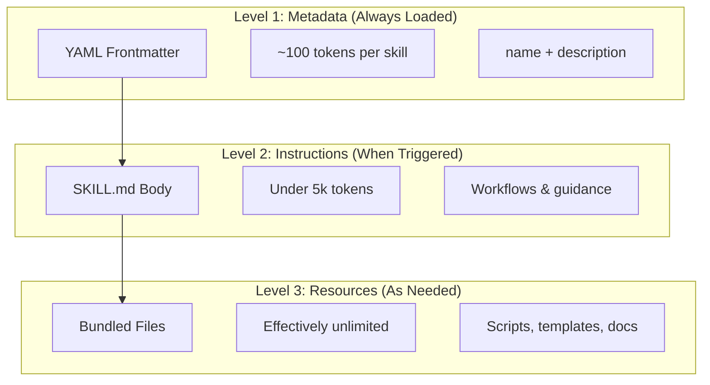
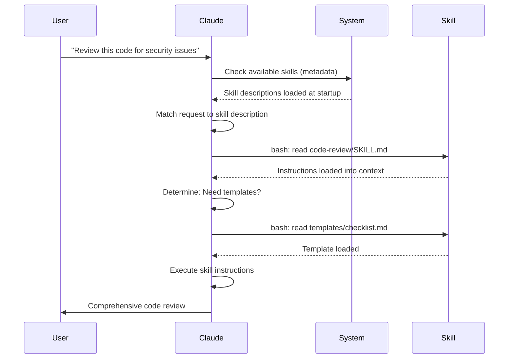

<picture>
  <source media="(prefers-color-scheme: dark)" srcset="../resources/logos/claude-howto-logo-dark.svg">
  
</picture>

# Agent Skills 指南

Agent Skills （智能体技能）是基于文件系统的可复用能力，用于扩展 Claude 的功能。
它们将特定领域的专业知识、工作流程和最佳实践打包成可发现的组件，Claude 在相关情境下会自动使用这些组件。

## 概述

**智能体技能**是模块化能力，可将通用智能体转变为特定领域的专家。与提示词（用于一次性任务的对话级指令）不同，技能按需加载，无需在多次对话中重复提供相同的指导。

### 核心优势

- **让 Claude 术业专攻**：为特定领域任务定制专属能力
- **减少重复劳动**：一次创建，跨对话自动调用
- **灵活组合能力**：将多个技能组合以构建复杂工作流
- **规模化工作流**：跨多个项目与团队复用技能
- **保障质量水准**：将最佳实践直接嵌入工作流

技能遵循 [Agent Skills](https://agentskills.io) 开放标准，该标准可跨多种 AI 工具运行。
Claude Code 在此基础上进行了功能扩展，增加了调用控制、子代理执行以及动态上下文注入等特性。

> **说明**：自定义斜杠命令已并入技能体系。`.claude/commands/` 目录下的文件仍然有效，且支持相同的前言元数据字段。对于新开发项目，推荐使用技能方式。若同一路径下同时存在命令与技能（例如 `.claude/commands/review.md` 与 `.claude/skills/review/SKILL.md`），则技能优先。

## 技能工作原理：渐进式披露

技能采用**渐进式披露**架构，Claude 根据需求分阶段加载信息，而非预先占用上下文。
这一机制实现了高效的上下文管理，同时确保无限的可扩展性。

### 三个加载层级



| 层级 | 加载时机 | Token 开销 | 内容说明 |
|-------|------------|------------|---------|
| **第一级：元数据** | 始终加载（启动时） | 每个技能约 100 tokens | YAML 前言元数据中的 `name` 和 `description` 字段 |
| **第二级：指令内容** | 技能被触发时 | 低于 5000 tokens | SKILL.md 主体内容，包含指令与指导说明 |
| **第三级及以上：资源文件** | 按需加载 | 实际无限制 | 通过 Bash 执行的相关打包文件，无需将内容加载至上下文 |

这意味着你可以安装大量技能而不必担心上下文开销，Claude 仅知道每个技能的存在及其适用场景，只有在技能被实际触发时才会加载详细内容。

## 技能加载流程



## 技能类型与存放位置

| 类型 | 存放位置 | 作用域 | 是否共享 | 适用场景 |
|------|----------|-------|--------|----------|
| 企业级 | 托管设置 | 组织内所有用户 | 是 | 组织级规范标准 |
| 个人级 | `~/.claude/skills/<skill-name>/SKILL.md` | 个人 | 否 | 个人工作流 |
| 项目级 | `.claude/skills/<skill-name>/SKILL.md` | 团队 | 是（通过 Git） | 团队标准 |
| 插件 | `<plugin>/skills/<skill-name>/SKILL.md` | 启用插件处 | 视情况 | 随插件打包 |

当不同层级中存在同名技能时，优先级更高的位置会胜出：**企业级 > 个人级 > 项目级**。
插件技能采用 `plugin-name:skill-name` 的命名空间，因此不会发生冲突。

### 自动发现机制

**嵌套目录**：
当你在子目录中操作文件时，Claude Code 会自动从嵌套的 `.claude/skills/` 目录中发现技能。
例如，若你在 `packages/frontend/` 中编辑文件，Claude Code 也会在 `packages/frontend/.claude/skills/` 中查找技能。
这适用于单一代码仓库 monorepo 结构，其中各软件包拥有各自的专属技能。

**`--add-dir` 添加的目录**：
通过 `--add-dir` 添加的目录中的技能会自动加载，并具备实时变更检测能力。
对这些目录下技能文件的任何修改都会即时生效，无需重启 Claude Code。

**描述内容预算**：
技能描述（第一级元数据）的上限为**上下文窗口的 1%**（后备值为 **8,000 个字符**）。
若你安装了众多技能，描述内容可能会被精简。
所有技能的名称都会完整保留，但描述会被修剪以适应预算。请将核心使用场景置于描述的开头部分。
预算可通过 `SLASH_COMMAND_TOOL_CHAR_BUDGET` 环境变量进行覆写调整。

## 创建自定义技能

### 基本目录结构

```
my-skill/
├── SKILL.md           # Main instructions (required)
├── template.md        # Template for Claude to fill in
├── examples/
│   └── sample.md      # Example output showing expected format
└── scripts/
    └── validate.sh    # Script Claude can execute
```

### SKILL.md 文件格式

```yaml
---
name: your-skill-name
description: Brief description of what this Skill does and when to use it
---

# Your Skill Name

## Instructions
Provide clear, step-by-step guidance for Claude.

## Examples
Show concrete examples of using this Skill.
```

### 必填字段

- **name**：仅限小写字母、数字和连字符（最多 64 个字符）。不得包含 "anthropic" 或 "claude"。
- **description**：描述技能的功能及其使用时机（最多 1024 个字符）。该字段对于 Claude 判断何时激活技能至关重要。

### 可选的 Frontmatter 前言元数据字段

```yaml
---
name: my-skill
description: What this skill does and when to use it
argument-hint: "[filename] [format]"        # Hint for autocomplete
disable-model-invocation: true              # Only user can invoke
user-invocable: false                       # Hide from slash menu
allowed-tools: Read, Grep, Glob             # Restrict tool access
model: opus                                 # Specific model to use
effort: high                                # Effort level override (low, medium, high, max)
context: fork                               # Run in isolated subagent
agent: Explore                              # Which agent type (with context: fork)
shell: bash                                 # Shell for commands: bash (default) or powershell
hooks:                                      # Skill-scoped hooks
  PreToolUse:
    - matcher: "Bash"
      hooks:
        - type: command
          command: "./scripts/validate.sh"
paths: "src/api/**/*.ts"               # Glob patterns limiting when skill activates
---
```

| 字段 | 说明 |
|-------|-------------|
| `name` | 仅限小写字母、数字、连字符（最多 64 个字符）。不得包含 "anthropic" 或 "claude"。 |
| `description` | 描述技能的功能及其使用时机（最多 1024 个字符）。对自动调用匹配至关重要。 |
| `argument-hint` | 在 `/` 自动补全菜单中显示的提示信息（例如 `"[filename] [format]"`）。 |
| `disable-model-invocation` | 设为 `true` 表示仅用户可通过 `/name` 调用，Claude 绝不会自动调用该技能。 |
| `user-invocable` | 设为 `false` 表示在 `/` 菜单中隐藏该技能，仅 Claude 可自动调用。 |
| `allowed-tools` | 技能无需权限提示即可使用的工具，以逗号分隔。 |
| `model` | 技能激活期间所使用的模型（例如 `opus`、`sonnet`）。 |
| `effort` | 技能激活期间所采用的强度级别：`low`、`medium`、`high` 或 `max`。 |
| `context` | 设为 `fork` 则在独立的子代理上下文中运行该技能，拥有独立的上下文窗口。 |
| `agent` | 当 `context: fork` 时指定子代理类型（例如 `Explore`、`Plan`、`general-purpose`）。 |
| `shell` | 执行`!`命令及脚本时所用的 Shell：`bash`（默认）或 `powershell`。 |
| `hooks` | 作用域限定在该技能生命周期内的钩子（格式与全局钩子相同）。 |
| `paths` | 限定技能自动激活条件的 Glob 模式。可提供逗号分隔的字符串或 YAML 列表。格式与路径专属规则一致。 |

## 技能内容类型

技能可包含两类内容，各自适用于不同用途：

### 参考内容

添加 Claude 在当前工作中可应用的知识，约定规范、设计模式、风格指南、领域知识。
这些内容会在对话上下文中内联运行。

```yaml
---
name: api-conventions
description: API design patterns for this codebase
---

When writing API endpoints:
- Use RESTful naming conventions
- Return consistent error formats
- Include request validation
```

### 任务内容

用于特定操作的分步指令。
通常通过 `/skill-name` 直接调用。

```yaml
---
name: deploy
description: Deploy the application to production
context: fork
disable-model-invocation: true
---

Deploy the application:
1. Run the test suite
2. Build the application
3. Push to the deployment target
```

## 控制技能调用方式

默认情况下，你和 Claude 均可调用任意技能。以下两个前言元数据字段可控制三种调用模式：

| 前言元数据 | 你可调用 | Claude 可调用 |
|---|---|---|
| （默认） | 是 | 是 |
| `disable-model-invocation: true` | 是 | 否 |
| `user-invocable: false` | 否 | 是 |

**对具有副作用的操作使用 `disable-model-invocation: true`**，例如：`/commit`、`/deploy`、`/send-slack-message`。你不会希望 Claude 仅因为代码看起来就绪而自行决定部署。

**对不宜作为命令执行的背景知识使用 `user-invocable: false`**。例如，一个名为 `legacy-system-context` 的技能用于说明旧系统的运作方式，这对 Claude 很有用，但对用户来说并非一个有意义的可执行操作。


## 字符串替换

技能支持动态变量，这些变量在技能内容送达 Claude 之前即会被解析替换：

| 变量 | 说明 |
|----------|-------------|
| `$ARGUMENTS` | 调用技能时传入的全部参数 |
| `$ARGUMENTS[N]` 或 `$N` | 按索引访问特定参数（从 0 开始计数） |
| `${CLAUDE_SESSION_ID}` | 当前会话 ID |
| `${CLAUDE_SKILL_DIR}` | 包含该技能 SKILL.md 文件的目录路径 |
| `` !`command` `` | 动态上下文注入，运行 Shell 命令并将其输出内联插入 |

**示例：**

```yaml
---
name: fix-issue
description: Fix a GitHub issue
---

Fix GitHub issue $ARGUMENTS following our coding standards.
1. Read the issue description
2. Implement the fix
3. Write tests
4. Create a commit
```

运行 `/fix-issue 123` 会将 `$ARGUMENTS` 替换为 `123`。

## 注入动态上下文

`` !`command` `` 语法可在技能内容发送给 Claude 之前运行 Shell 命令：

```yaml
---
name: pr-summary
description: Summarize changes in a pull request
context: fork
agent: Explore
---

## Pull request context
- PR diff: !`gh pr diff`
- PR comments: !`gh pr view --comments`
- Changed files: !`gh pr diff --name-only`

## Your task
Summarize this pull request...
```

命令即时执行；Claude 仅能看到最终输出结果。
默认情况下，命令在 `bash` 中运行。
若需改用 PowerShell，可在前言元数据中设置 `shell: powershell`。

## 在子代理中运行技能

添加 `context: fork` 可在隔离的子代理上下文中运行技能。
此时技能内容将成为专属子代理的任务，该子代理拥有独立的上下文窗口，从而保持主对话的整洁清晰。

`agent` 字段用于指定所使用的代理类型：

| 代理类型 | 适用场景 |
|---|---|
| `Explore` | 只读调研、代码库分析 |
| `Plan` | 创建实现方案 |
| `general-purpose` | 需要全部工具的广泛任务 |
| 自定义代理 | 配置中定义的专业代理 |

**Frontmatter 前言元数据示例：**

```yaml
---
context: fork
agent: Explore
---
```

**完整技能示例：**

```yaml
---
name: deep-research
description: Research a topic thoroughly
context: fork
agent: Explore
---

Research $ARGUMENTS thoroughly:
1. Find relevant files using Glob and Grep
2. Read and analyze the code
3. Summarize findings with specific file references
```

## 实用示例

### 示例 1：代码审查技能

**目录结构：**

```
~/.claude/skills/code-review/
├── SKILL.md
├── templates/
│   ├── review-checklist.md
│   └── finding-template.md
└── scripts/
    ├── analyze-metrics.py
    └── compare-complexity.py
```

**文件：** `~/.claude/skills/code-review/SKILL.md`

```yaml
---
name: code-review-specialist
description: Comprehensive code review with security, performance, and quality analysis. Use when users ask to review code, analyze code quality, evaluate pull requests, or mention code review, security analysis, or performance optimization.
---

# Code Review Skill

This skill provides comprehensive code review capabilities focusing on:

1. **Security Analysis**
   - Authentication/authorization issues
   - Data exposure risks
   - Injection vulnerabilities
   - Cryptographic weaknesses

2. **Performance Review**
   - Algorithm efficiency (Big O analysis)
   - Memory optimization
   - Database query optimization
   - Caching opportunities

3. **Code Quality**
   - SOLID principles
   - Design patterns
   - Naming conventions
   - Test coverage

4. **Maintainability**
   - Code readability
   - Function size (should be < 50 lines)
   - Cyclomatic complexity
   - Type safety

## Review Template

For each piece of code reviewed, provide:

### Summary
- Overall quality assessment (1-5)
- Key findings count
- Recommended priority areas

### Critical Issues (if any)
- **Issue**: Clear description
- **Location**: File and line number
- **Impact**: Why this matters
- **Severity**: Critical/High/Medium
- **Fix**: Code example

For detailed checklists, see [templates/review-checklist.md](templates/review-checklist.md).
```

### 示例 2：代码库可视化技能

一个生成交互式 HTML 可视化图表的技能：

**目录结构：**

```
~/.claude/skills/codebase-visualizer/
├── SKILL.md
└── scripts/
    └── visualize.py
```

**文件：** `~/.claude/skills/codebase-visualizer/SKILL.md`

````yaml
---
name: codebase-visualizer
description: Generate an interactive collapsible tree visualization of your codebase. Use when exploring a new repo, understanding project structure, or identifying large files.
allowed-tools: Bash(python *)
---

# Codebase Visualizer

Generate an interactive HTML tree view showing your project's file structure.

## Usage

Run the visualization script from your project root:

```bash
python ~/.claude/skills/codebase-visualizer/scripts/visualize.py .
```

This creates `codebase-map.html` and opens it in your default browser.

## What the visualization shows

- **Collapsible directories**: Click folders to expand/collapse
- **File sizes**: Displayed next to each file
- **Colors**: Different colors for different file types
- **Directory totals**: Shows aggregate size of each folder
````

内置的 Python 脚本承担主要工作负载，而 Claude 负责编排协调。

### 示例 3：部署技能（仅限用户调用）

```yaml
---
name: deploy
description: Deploy the application to production
disable-model-invocation: true
allowed-tools: Bash(npm *), Bash(git *)
---

Deploy $ARGUMENTS to production:

1. Run the test suite: `npm test`
2. Build the application: `npm run build`
3. Push to the deployment target
4. Verify the deployment succeeded
5. Report deployment status
```

### 示例 4：品牌语调技能（背景知识）

```yaml
---
name: brand-voice
description: Ensure all communication matches brand voice and tone guidelines. Use when creating marketing copy, customer communications, or public-facing content.
user-invocable: false
---

## Tone of Voice
- **Friendly but professional** - approachable without being casual
- **Clear and concise** - avoid jargon
- **Confident** - we know what we're doing
- **Empathetic** - understand user needs

## Writing Guidelines
- Use "you" when addressing readers
- Use active voice
- Keep sentences under 20 words
- Start with value proposition

For templates, see [templates/](templates/).
```

### 示例 5：CLAUDE.md 生成器技能

```yaml
---
name: claude-md
description: Create or update CLAUDE.md files following best practices for optimal AI agent onboarding. Use when users mention CLAUDE.md, project documentation, or AI onboarding.
---

## Core Principles

**LLMs are stateless**: CLAUDE.md is the only file automatically included in every conversation.

### The Golden Rules

1. **Less is More**: Keep under 300 lines (ideally under 100)
2. **Universal Applicability**: Only include information relevant to EVERY session
3. **Don't Use Claude as a Linter**: Use deterministic tools instead
4. **Never Auto-Generate**: Craft it manually with careful consideration

## Essential Sections

- **Project Name**: Brief one-line description
- **Tech Stack**: Primary language, frameworks, database
- **Development Commands**: Install, test, build commands
- **Critical Conventions**: Only non-obvious, high-impact conventions
- **Known Issues / Gotchas**: Things that trip up developers
```

### 示例 6：附带脚本的重构技能

**目录结构：**

```
refactor/
├── SKILL.md
├── references/
│   ├── code-smells.md
│   └── refactoring-catalog.md
├── templates/
│   └── refactoring-plan.md
└── scripts/
    ├── analyze-complexity.py
    └── detect-smells.py
```

**文件：** `refactor/SKILL.md`

```yaml
---
name: code-refactor
description: Systematic code refactoring based on Martin Fowler's methodology. Use when users ask to refactor code, improve code structure, reduce technical debt, or eliminate code smells.
---

# Code Refactoring Skill

A phased approach emphasizing safe, incremental changes backed by tests.

## Workflow

Phase 1: Research & Analysis → Phase 2: Test Coverage Assessment →
Phase 3: Code Smell Identification → Phase 4: Refactoring Plan Creation →
Phase 5: Incremental Implementation → Phase 6: Review & Iteration

## Core Principles

1. **Behavior Preservation**: External behavior must remain unchanged
2. **Small Steps**: Make tiny, testable changes
3. **Test-Driven**: Tests are the safety net
4. **Continuous**: Refactoring is ongoing, not a one-time event

For code smell catalog, see [references/code-smells.md](references/code-smells.md).
For refactoring techniques, see [references/refactoring-catalog.md](references/refactoring-catalog.md).
```

## 支持文件

技能目录中除了 `SKILL.md` 之外，还可包含多个文件。
这些支持文件（如模板、示例、脚本、参考文档）让主技能文件保持精简的同时，为 Claude 提供可按需加载的额外资源。

```
my-skill/
├── SKILL.md              # Main instructions (required, keep under 500 lines)
├── templates/            # Templates for Claude to fill in
│   └── output-format.md
├── examples/             # Example outputs showing expected format
│   └── sample-output.md
├── references/           # Domain knowledge and specifications
│   └── api-spec.md
└── scripts/              # Scripts Claude can execute
    └── validate.sh
```

支持文件的使用指南：

- 将 `SKILL.md` 保持在 **500 行**以内。把详细的参考资料、大型示例和规范文档移至独立文件中。
- 在 `SKILL.md` 中使用**相对路径**引用其他文件（例如 `[API reference](references/api-spec.md)`）。
- 支持文件在第三级（按需加载）才会被加载，因此在 Claude 实际读取之前不会占用上下文空间。

## 管理技能

### 查看可用技能

直接向 Claude 询问：

```
What Skills are available?
```

或者检查文件系统：

```bash
# List personal Skills
ls ~/.claude/skills/

# List project Skills
ls .claude/skills/
```

### 测试技能

有两种测试方式：

**让 Claude 自动调用**：提出与技能描述相匹配的问题。

```
Can you help me review this code for security issues?
```

**或直接调用**：使用技能名称触发。

```
/code-review src/auth/login.ts
```

### 更新技能

直接编辑 `SKILL.md` 文件即可。
修改内容将在下次启动 Claude Code 时生效。

```bash
# Personal Skill
code ~/.claude/skills/my-skill/SKILL.md

# Project Skill
code .claude/skills/my-skill/SKILL.md
```

### 限制 Claude 的技能访问权限

有三种方式可以控制 Claude 可以调用哪些技能：

**在 `/permissions` 中禁用所有技能**：

```
# Add to deny rules:
Skill
```

**允许或拒绝特定技能**：

```
# Allow only specific skills
Skill(commit)
Skill(review-pr *)

# Deny specific skills
Skill(deploy *)
```

**隐藏单个技能**：在其前言元数据中添加 `disable-model-invocation: true`。

## 最佳实践

### 1. 确保描述具体明确

- **不推荐（模糊）**：“帮助处理文档”
- **推荐（具体）**：“从 PDF 文件中提取文本和表格、填写表单、合并文档。适用于处理 PDF 文件，或用户提及 PDF、表单、文档提取等场景。”

### 2. 保持技能专注单一

- 一项技能对应一种能力
- ✅ “PDF 表单填写”
- ❌ “文档处理”（范围过宽）

### 3. 包含触发关键词

在描述中添加与用户请求相匹配的关键词：

```yaml
description: Analyze Excel spreadsheets, generate pivot tables, create charts. Use when working with Excel files, spreadsheets, or .xlsx files.
```

### 4. 将 SKILL.md 保持在 500 行以内

将详细参考资料移至独立文件中，供 Claude 按需加载。

### 5. 引用支持文件

```markdown
## Additional resources

- For complete API details, see [reference.md](reference.md)
- For usage examples, see [examples.md](examples.md)
```

### 建议事项

- 使用清晰、描述性的名称
- 包含详尽的指令说明
- 添加具体示例
- 打包相关的脚本和模板
- 基于真实场景进行测试
- 记录依赖项

### 禁忌事项

- 不要为一次性任务创建技能
- 不要重复已有功能
- 不要使技能范围过于宽泛
- 不要省略描述字段
- 未经审计，不要安装来自不可信来源的技能

## 故障排查

### 快速参考

| 问题 | 解决方案 |
|-------|----------|
| Claude 未使用该技能 | 在描述中添加更具体的触发关键词 |
| 找不到技能文件 | 验证路径：`~/.claude/skills/name/SKILL.md` |
| YAML 错误 | 检查 `---` 标记、缩进，勿使用制表符 |
| 技能命名冲突 | 在描述中使用不同的触发关键词 |
| 脚本无法运行 | 检查权限：`chmod +x scripts/*.py` |
| Claude 未列出所有技能 | 技能数量过多；检查 `/context` 是否有警告 |

### 技能未被触发

若 Claude 未按预期使用你的技能：

1. 检查描述是否包含用户可能自然说出的关键词
2. 询问“有哪些可用技能？”验证该技能是否出现在列表中
3. 尝试重新表述请求，使其与描述内容匹配
4. 直接使用 `/skill-name` 调用以进行测试

### 技能触发过于频繁

若 Claude 在不必要的情况下使用了该技能：

1. 让描述内容更加具体明确
2. 添加 `disable-model-invocation: true` 以仅允许手动调用

### Claude 未列出所有技能

技能描述内容的加载上限为**上下文窗口的 1%**（后备值为 **8,000 个字符**）。
无论预算多少，每个技能条目的描述均被限制在 250 个字符以内。
运行 `/context` 可检查是否有技能被排除的警告。
预算可通过 `SLASH_COMMAND_TOOL_CHAR_BUDGET` 环境变量进行覆写调整。

## 安全考量

**仅使用来自可信来源的技能。** 技能通过指令与代码赋予 Claude 相应的能力，恶意技能可能引导 Claude 以有害方式调用工具或执行代码。

**核心安全考量：**

- **彻底审计**：审查技能目录中的所有文件
- **外部来源存在风险**：从外部 URL 获取资源的技能可能遭到篡改
- **工具滥用风险**：恶意技能可能以有害方式调用工具
- **视同安装软件**：仅使用来自可信来源的技能

## Skills vs 其他功能

| 功能 | 调用方式 | 适用场景 |
|---------|------------|----------|
| **Skills 技能** | 自动调用或 `/name` | 可复用的专业知识、工作流程 |
| **Slash Commands 斜杠命令** | 用户手动调用 `/name` | 快速快捷操作（已并入技能体系） |
| **Subagents 子代理** | 自动委派 | 隔离环境下的任务执行 |
| **Memory 记忆 (CLAUDE.md)** | 始终加载 | 持久化的项目上下文 |
| **MCP** | 实时 | 外部数据/服务访问 |
| **Hooks 钩子** | 事件驱动 | 自动化副作用操作 |

## 内置技能

Claude Code 附带了若干无需安装即可直接使用的内置技能：

| 技能 | 描述 |
|-------|-------------|
| `/simplify` | 审查已更改文件的可复用性、质量与效率；生成 3 个并行的审查代理 |
| `/batch <instruction>` | 使用 Git 工作树在代码库中编排大规模并行更改 |
| `/debug [description]` | 通过读取调试日志排查当前会话的问题 |
| `/loop [interval] <prompt>` | 按指定间隔重复运行提示（例如 `/loop 5m 检查部署状态`） |
| `/claude-api` | 加载 Claude API/SDK 参考文档；当代码中出现 `anthropic` 或 `@anthropic-ai/sdk` 导入语句时自动激活 |

这些技能开箱即用，无需额外安装或配置。
它们遵循与自定义技能相同的 `SKILL.md` 文件格式。

## 共享技能

### 项目技能（团队共享）

1. 在 `.claude/skills/` 目录中创建技能
2. 提交至 Git 仓库
3. 团队成员拉取更新，技能立即可用

### 个人技能

```bash
# Copy to personal directory
cp -r my-skill ~/.claude/skills/

# Make scripts executable
chmod +x ~/.claude/skills/my-skill/scripts/*.py
```

### 插件分发

将技能打包到插件的 `skills/` 目录中，以便更广泛地分发。

## 更进一步：技能合集与技能管理器

一旦你开始认真构建技能，两样东西就变得不可或缺：一个经验证的技能库，以及一个管理它们的工具。

**[luongnv89/skills](https://github.com/luongnv89/skills)**
我在日常几乎所有项目中都会用到的技能合集。
其中亮点包括 `logo-designer`（动态生成项目徽标）和 `ollama-optimizer`（根据你的硬件调优本地 LLM 性能）。
如果你想要现成可用的技能，这是个很棒的起点。

**[luongnv89/asm](https://github.com/luongnv89/asm)**
智能体技能管理器。
用于处理技能开发、重复检测及测试。
`asm link` 命令让你无需四处复制文件就能在任何项目中测试技能，一旦你拥有不止少数几个技能，这一功能就变得必不可少。

## 其他资源

- [Official Skills Documentation](https://code.claude.com/docs/en/skills)
- [Agent Skills Architecture Blog](https://claude.com/blog/equipping-agents-for-the-real-world-with-agent-skills)
- [Skills Repository](https://github.com/luongnv89/skills) - Collection of ready-to-use skills
- [Slash Commands Guide](../01-slash-commands/) - User-initiated shortcuts
- [Subagents Guide](../04-subagents/) - Delegated AI agents
- [Memory Guide](../02-memory/) - Persistent context
- [MCP (Model Context Protocol)](../05-mcp/) - Real-time external data
- [Hooks Guide](../06-hooks/) - Event-driven automation

---
**Last Updated**: April 2026
**Claude Code Version**: 2.1+
**Compatible Models**: Claude Sonnet 4.6, Claude Opus 4.6, Claude Haiku 4.5
