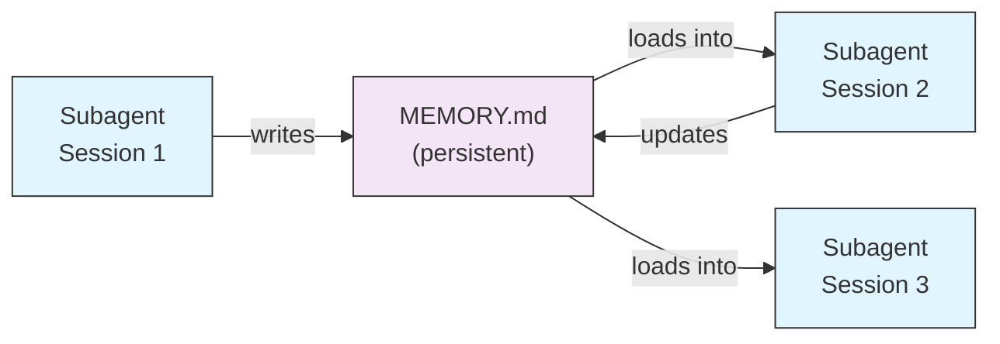
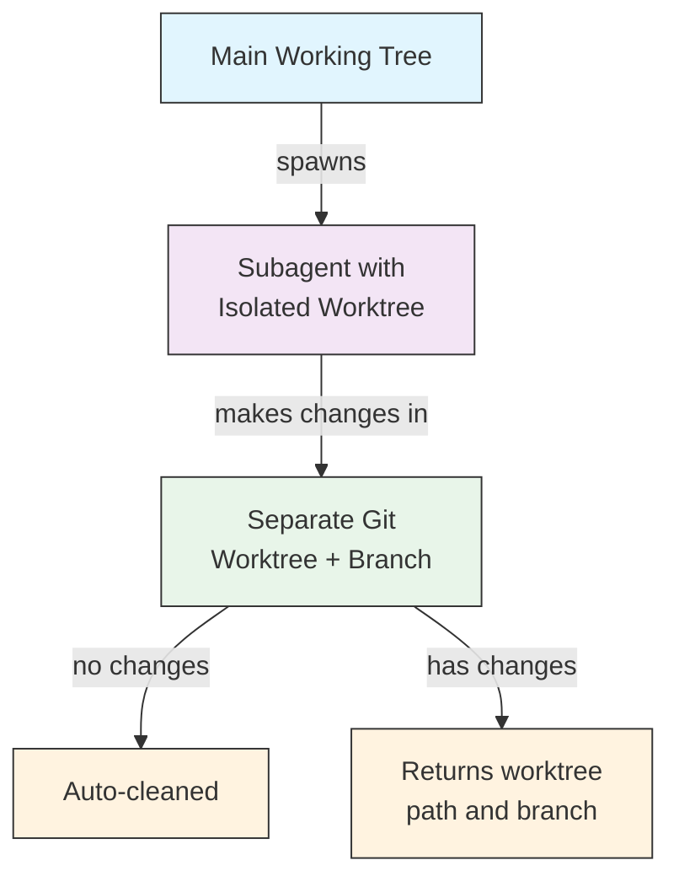
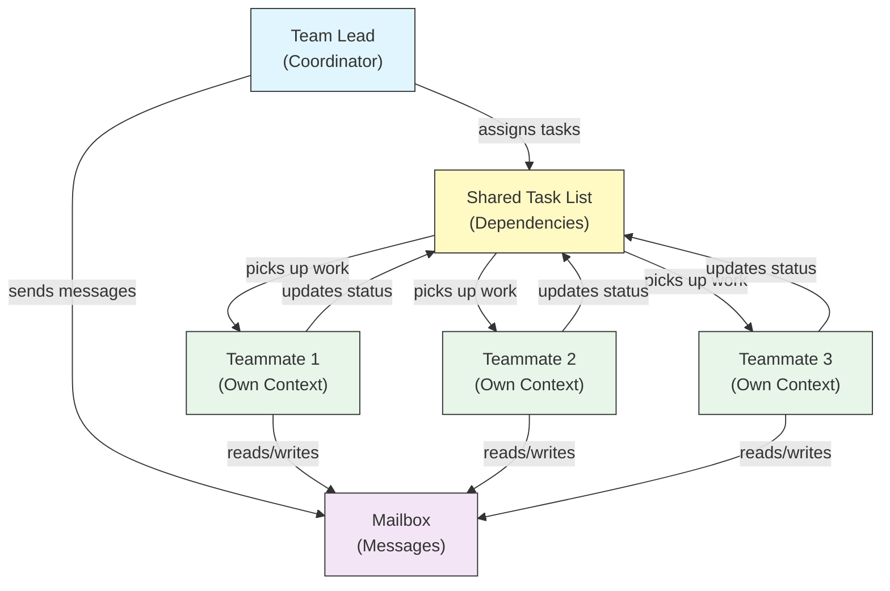
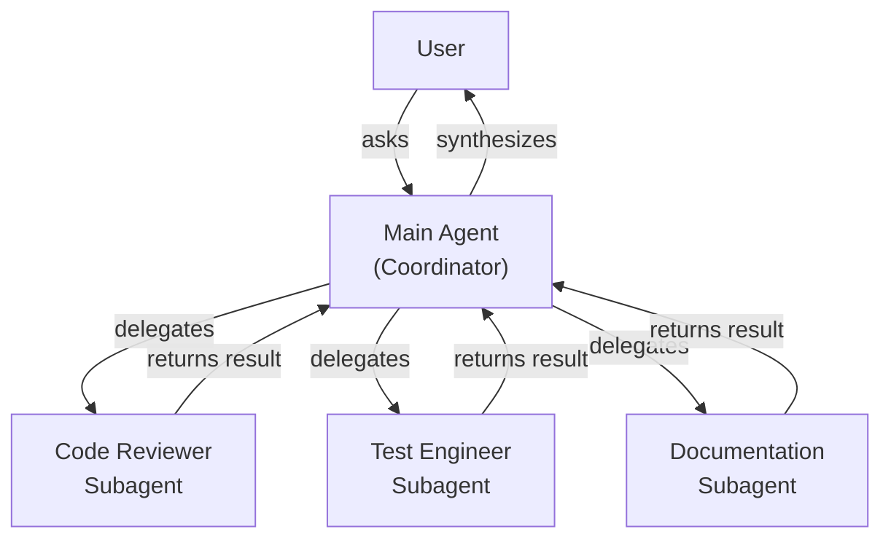
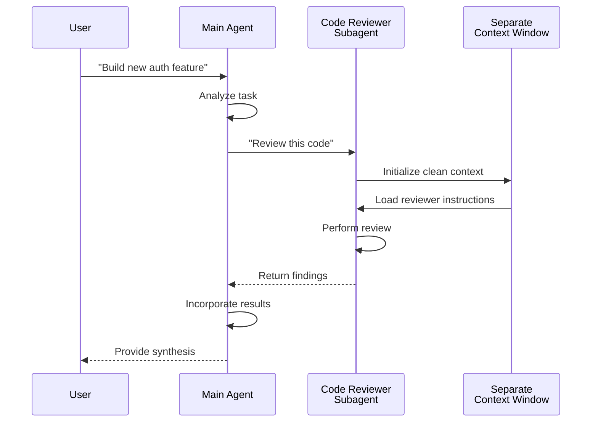
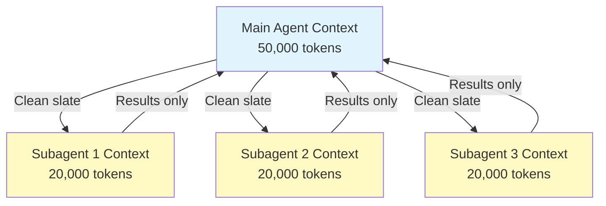
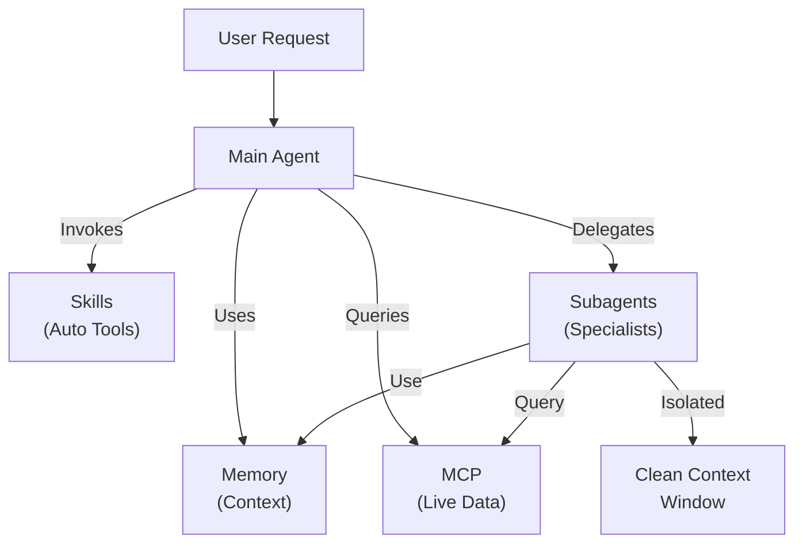

<picture>
  <source media="(prefers-color-scheme: dark)" srcset="../resources/logos/claude-howto-logo-dark.svg">
  
</picture>

# Subagents 子代理——完整参考指南

子代理是 Claude Code 可委派任务给它们的专用 AI 助手。每个子代理都有特定的用途，使用独立于主对话的专属上下文窗口，并可配置特定的工具及自定义系统提示词。

## 目录

1. [概述](#概述)
2. [核心优势](#核心优势)
3. [文件位置](#文件位置)
4. [配置](#配置)
5. [内置子代理](#内置子代理)
6. [管理子代理](#管理子代理)
7. [使用子代理](#使用子代理)
8. [可恢复代理](#可恢复代理)
9. [链式子代理](#链式子代理)
10. [子代理的持久化记忆](#子代理的持久化记忆)
11. [后台子代理](#后台子代理)
12. [工作树隔离](#工作树隔离)
13. [限制可生成的子代理](#限制可生成的子代理)
14. [`claude agents` CLI 命令](#claude-agents-cli-命令)
15. [代理团队（实验性）](#代理团队实验性)
16. [插件子代理安全](#插件子代理安全)
17. [架构](#架构)
18. [上下文管理](#上下文管理)
19. [何时使用子代理](#何时使用子代理)
20. [最佳实践](#最佳实践)
21. [本文件夹中的子代理示例](#本文件夹中的子代理示例)
22. [安装说明](#安装说明)
23. [相关概念](#相关概念)

---

## 概述

子代理通过以下方式在 Claude Code 中实现任务的委派执行：

- 创建拥有独立上下文窗口的**隔离式 AI 助手**
- 提供**自定义的系统提示词**以实现专业领域的专长
- 实施**工具访问控制**以限制能力范围
- 防止复杂任务造成的**上下文污染**
- 支持多个专业任务的**并行执行**

每个子代理以全新的初始状态独立运行，仅接收执行任务所必需的特定上下文，然后将结果返回给主代理进行综合处理。

**快速入门**：使用 `/agents` 命令可以交互式地创建、查看、编辑和管理你的子代理。

---

## 核心优势

| 优势 | 描述 |
|---------|-------------|
| 上下文隔离 | 在独立上下文中运行，防止主对话受到污染 |
| 专业领域知识 | 针对特定领域进行精细调校，成功率更高 |
| 可复用性 | 可在不同项目中使用，并与团队共享 |
| 灵活的权限控制 | 不同子代理类型可设置不同的工具访问级别 |
| 可扩展性 | 多个代理可同时处理不同方面的工作 |

---

## 文件位置

子代理文件可存放在不同位置，其作用域各不相同：

| 优先级 | 类型 | 位置 | 作用域 |
|----------|------|----------|-------|
| 1（最高） | CLI 定义的 | 通过 `--agents` 标志传入（JSON） | 仅当前会话 |
| 2 | 项目子代理 | `.claude/agents/` | 当前项目 |
| 3 | 用户子代理 | `~/.claude/agents/` | 所有项目 |
| 4（最低） | 插件代理 | 插件的 `agents/` 目录 | 通过插件生效 |

当出现同名情况时，优先级更高的来源将胜出。

---

## 配置

### 文件格式

子代理采用 YAML frontmatter 前言元数据定义，其后跟随以 Markdown 编写的系统提示词：

```yaml
---
name: your-sub-agent-name
description: Description of when this subagent should be invoked
tools: tool1, tool2, tool3  # Optional - inherits all tools if omitted
disallowedTools: tool4  # Optional - explicitly disallowed tools
model: sonnet  # Optional - sonnet, opus, haiku, or inherit
permissionMode: default  # Optional - permission mode
maxTurns: 20  # Optional - limit agentic turns
skills: skill1, skill2  # Optional - skills to preload into context
mcpServers: server1  # Optional - MCP servers to make available
memory: user  # Optional - persistent memory scope (user, project, local)
background: false  # Optional - run as background task
effort: high  # Optional - reasoning effort (low, medium, high, max)
isolation: worktree  # Optional - git worktree isolation
initialPrompt: "Start by analyzing the codebase"  # Optional - auto-submitted first turn
hooks:  # Optional - component-scoped hooks
  PreToolUse:
    - matcher: "Bash"
      hooks:
        - type: command
          command: "./scripts/security-check.sh"
---

Your subagent's system prompt goes here. This can be multiple paragraphs
and should clearly define the subagent's role, capabilities, and approach
to solving problems.
```

## 配置字段

| 字段 | 是否必需 | 描述 |
|-------|----------|-------------|
| `name` | 是 | 唯一标识符（仅限小写字母和连字符） |
| `description` | 是 | 用途的自然语言描述。包含 "use PROACTIVELY" 可鼓励自动调用 |
| `tools` | 否 | 逗号分隔的特定工具列表。省略则继承全部工具。支持 `Agent(agent_name)` 语法以限制可生成的子代理 |
| `disallowedTools` | 否 | 逗号分隔的子代理禁止使用的工具列表 |
| `model` | 否 | 使用的模型：`sonnet`、`opus`、`haiku`、完整模型 ID 或 `inherit`。默认使用配置的子代理模型 |
| `permissionMode` | 否 | `default`、`acceptEdits`、`dontAsk`、`bypassPermissions`、`plan` |
| `maxTurns` | 否 | 子代理可执行的最大代理轮次 |
| `skills` | 否 | 逗号分隔的要预加载的技能列表。在启动时将技能完整内容注入子代理的上下文 |
| `mcpServers` | 否 | 供子代理使用的 MCP 服务器 |
| `hooks` | 否 | 组件作用域的钩子（PreToolUse、PostToolUse、Stop） |
| `memory` | 否 | 持久化记忆目录作用域：`user`、`project` 或 `local` |
| `background` | 否 | 设为 `true` 则始终以后台任务形式运行此子代理 |
| `effort` | 否 | 推理强度级别：`low`、`medium`、`high` 或 `max` |
| `isolation` | 否 | 设为 `worktree` 可为子代理提供专属的 git 工作树 |
| `initialPrompt` | 否 | 当子代理作为主代理运行时，自动提交的首轮内容 |

### 工具配置选项

**选项 1：继承全部工具（省略该字段）**

```yaml
---
name: full-access-agent
description: Agent with all available tools
---
```

**选项 2：指定单个工具**

```yaml
---
name: limited-agent
description: Agent with specific tools only
tools: Read, Grep, Glob, Bash
---
```

**选项 3：条件式工具访问**

```yaml
---
name: conditional-agent
description: Agent with filtered tool access
tools: Read, Bash(npm:*), Bash(test:*)
---
```

### 基于命令行的配置

使用 `--agents` 标志配合 JSON 格式，为单次会话定义子代理：

```bash
claude --agents '{
  "code-reviewer": {
    "description": "Expert code reviewer. Use proactively after code changes.",
    "prompt": "You are a senior code reviewer. Focus on code quality, security, and best practices.",
    "tools": ["Read", "Grep", "Glob", "Bash"],
    "model": "sonnet"
  }
}'
```

**用于 `--agents` 标志的 JSON 格式：**

```json
{
  "agent-name": {
    "description": "Required: when to invoke this agent",
    "prompt": "Required: system prompt for the agent",
    "tools": ["Optional", "array", "of", "tools"],
    "model": "optional: sonnet|opus|haiku"
  }
}
```

**代理定义的优先级：**

代理定义的加载遵循以下优先级顺序（首个匹配项胜出）：
1. **CLI 定义的** - `--agents` 标志（仅当前会话，JSON 格式）
2. **项目级** - `.claude/agents/`（当前项目）
3. **用户级** - `~/.claude/agents/`（所有项目）
4. **插件级** - 插件的 `agents/` 目录

这意味着对于单次会话，CLI 定义的代理将覆盖所有其他来源。

---

## 内置子代理

Claude Code 包含若干始终可用的内置子代理：

| 代理 | 模型 | 用途 |
|-------|-------|---------|
| general-purpose | 继承 | 复杂的多步骤任务 |
| Plan | 继承 | 计划模式下的调研工作 |
| Explore | Haiku | 只读代码库探索（快速/中等/非常详尽） |
| Bash | 继承 | 在独立上下文中执行终端命令 |
| statusline-setup | Sonnet | 配置状态栏 |
| Claude Code Guide | Haiku | 回答 Claude Code 功能相关问题 |

### 通用型子代理

| 属性 | 值 |
|----------|-------|
| 模型 | 继承自父代理 |
| 工具 | 所有工具 |
| 用途 | 复杂研究任务、多步骤操作、代码修改 |

**使用场景**：需要同时涉及探索与修改，且包含复杂推理的任务。

### 计划子代理

| 属性 | 值 |
|----------|-------|
| 模型 | 继承自父代理 |
| 工具 | 读取（Read）、全局搜索（Glob）、内容搜索（Grep）、终端命令（Bash） |
| 用途 | 在计划模式下自动用于探索代码库 |

**使用场景**：当 Claude 需要在提交计划前理解代码库结构时。

### 探索子代理

| 属性 | 值 |
|----------|-------|
| 模型 | Haiku（快速、低延迟） |
| 模式 | 严格只读 |
| 工具 | 全局搜索（Glob）、内容搜索（Grep）、读取（Read）、终端命令（Bash，仅限只读命令） |
| 用途 | 快速代码库搜索与分析 |

**使用场景**：需要在不修改代码的情况下搜索或理解代码时。

**详尽程度**，可指定探索深度：
- **"quick"（快速）**：最小化探索范围，适合查找特定模式
- **"medium"（中等）**：适度探索，兼顾速度与深度，为默认方式
- **"very thorough"（非常详尽）**：跨多个位置和命名惯例进行全面分析，可能耗时较长

### Bash 子代理

| 属性 | 值 |
|----------|-------|
| 模型 | 继承自父代理 |
| 工具 | Bash（终端命令） |
| 用途 | 在独立的上下文窗口中执行终端命令 |

**使用场景**：当需要运行终端命令且希望利用隔离上下文时。

### 状态栏设置子代理

| 属性 | 值 |
|----------|-------|
| 模型 | Sonnet |
| 工具 | 读取（Read）、写入（Write）、终端命令（Bash） |
| 用途 | 配置 Claude Code 状态栏显示 |

**使用场景**：当需要设置或自定义状态栏时。

### Claude Code 指南子代理

| 属性 | 值 |
|----------|-------|
| 模型 | Haiku（快速、低延迟） |
| 工具 | 只读（Read-only） |
| 用途 | 回答关于 Claude Code 功能及使用方式的问题 |

**使用场景**：当用户询问 Claude Code 工作原理或特定功能的使用方法时。

---

## 管理子代理

### 使用 `/agents` 命令（推荐）

```bash
/agents
```

通过该交互式菜单可执行以下操作：
- 查看所有可用的子代理（内置、用户级及项目级）
- 在引导式设置下创建新的子代理
- 编辑现有的自定义子代理及工具访问权限
- 删除自定义子代理
- 当存在同名子代理时，查看哪些子代理处于激活状态

### 直接文件管理

```bash
# Create a project subagent
mkdir -p .claude/agents
cat > .claude/agents/test-runner.md << 'EOF'
---
name: test-runner
description: Use proactively to run tests and fix failures
---

You are a test automation expert. When you see code changes, proactively
run the appropriate tests. If tests fail, analyze the failures and fix
them while preserving the original test intent.
EOF

# Create a user subagent (available in all projects)
mkdir -p ~/.claude/agents
```

---

## 使用子代理

### 自动委派

Claude 会根据以下因素主动委派任务：
- 你请求中的任务描述
- 子代理配置中的 `description`（描述）字段
- 当前上下文及可用工具

若想鼓励主动调用，可在 `description` 字段中加入 "use PROACTIVELY" 或 "MUST BE USED"（例如中文为"应主动调用"）。

```yaml
---
name: code-reviewer
description: Expert code review specialist. Use PROACTIVELY after writing or modifying code.
---
```

### 显式调用

你可以显式请求使用特定的子代理：

```
> Use the test-runner subagent to fix failing tests
> Have the code-reviewer subagent look at my recent changes
> Ask the debugger subagent to investigate this error
```

### @提及调用

使用 `@` 前缀可确保调用指定的子代理（绕过自动委派的启发式规则）：

```
> @"code-reviewer (agent)" review the auth module
```

### 会话级代理

将特定代理作为主代理，运行整个会话：

```bash
# Via CLI flag
claude --agent code-reviewer

# Via settings.json
{
  "agent": "code-reviewer"
}
```

### 列出可用代理

使用 `claude agents` 命令列出所有已配置代理的来源：

```bash
claude agents
```

---

## 可恢复代理

子代理可以继续之前的对话，并完整保留上下文：

```bash
# Initial invocation
> Use the code-analyzer agent to start reviewing the authentication module
# Returns agentId: "abc123"

# Resume the agent later
> Resume agent abc123 and now analyze the authorization logic as well
```

**使用场景**：
- 跨多个会话的长期研究任务
- 在不丢失上下文的情况下进行迭代优化
- 保持上下文连续的多步骤工作流

---

## 链式子代理

按顺序依次执行多个子代理：

```bash
> First use the code-analyzer subagent to find performance issues,
  then use the optimizer subagent to fix them
```

这使得一个子代理的输出能够作为另一个子代理的输入，从而构建复杂的工作流。

---

## 子代理的持久化记忆

`memory` 字段为子代理提供了一个可在不同对话之间持久保留的目录。
这使得子代理能够随时间积累知识，存储笔记、发现成果以及在会话之间保持不变的上下文信息。

### Memory 记忆作用域

| 作用域 | 目录路径 | 适用场景 |
|-------|-----------|----------|
| `user` | `~/.claude/agent-memory/<name>/` | 跨所有项目的个人笔记与偏好设置 |
| `project` | `.claude/agent-memory/<name>/` | 与团队共享的、针对特定项目的知识 |
| `local` | `.claude/agent-memory-local/<name>/` | 不纳入版本控制的本地项目知识 |

### 工作原理

- 记忆目录中 `MEMORY.md` 的前 200 行内容会自动加载到子代理的系统提示词中
- `Read`、`Write` 和 `Edit` 工具会自动启用，以便子代理管理其记忆文件
- 子代理可按需在其记忆目录中创建其他文件

### 配置示例

```yaml
---
name: researcher
memory: user
---

You are a research assistant. Use your memory directory to store findings,
track progress across sessions, and build up knowledge over time.

Check your MEMORY.md file at the start of each session to recall previous context.
```



---

## 后台子代理

子代理可在后台运行，从而释放主对话以处理其他任务。

### 配置方式

在前言元数据中设置 `background: true`，即可使该子代理始终作为后台任务运行：

```yaml
---
name: long-runner
background: true
description: Performs long-running analysis tasks in the background
---
```

### 键盘快捷键

| 快捷键 | 操作 |
|----------|--------|
| `Ctrl+B` | 将当前正在运行的子代理任务转入后台 |
| `Ctrl+F` | 终止所有后台代理（按两次确认） |

### 禁用后台任务

设置环境变量以完全禁用后台任务支持：

```bash
export CLAUDE_CODE_DISABLE_BACKGROUND_TASKS=1
```

---

## 工作树隔离

`isolation: worktree` 设置可为子代理分配一个专属的 git 工作树，使其能够独立进行更改，而不影响主工作树。

### 配置

```yaml
---
name: feature-builder
isolation: worktree
description: Implements features in an isolated git worktree
tools: Read, Write, Edit, Bash, Grep, Glob
---
```

### 工作原理



- 子代理在独立的 git 工作树中运行，位于单独的分支上
- 若子代理未进行任何更改，工作树将被自动清理
- 若存在更改，工作树路径及分支名称将返回给主代理，以供审查或合并

---

## 限制可生成的子代理

你可以通过在 `tools` 字段中使用 `Agent(agent_type)` 语法，来控制某个子代理允许生成哪些其他子代理。
这是一种对可委派子代理进行白名单管理的方式。

> **注意**：在 v2.1.63 版本中，`Task` 工具已重命名为 `Agent`。现有的 `Task(...)` 引用仍可作为别名使用。

### 示例

```yaml
---
name: coordinator
description: Coordinates work between specialized agents
tools: Agent(worker, researcher), Read, Bash
---

You are a coordinator agent. You can delegate work to the "worker" and
"researcher" subagents only. Use Read and Bash for your own exploration.
```

在此示例中，`coordinator` 子代理仅能生成 `worker` 和 `researcher` 子代理。即使其他地方定义了其他子代理，它也无法生成。

---

## `claude agents` CLI 命令

`claude agents` 命令可按来源（内置、用户级、项目级）分组列出所有已配置的代理：

```bash
claude agents
```

该命令将：
- 显示所有来源的所有可用代理
- 按来源位置对代理进行分组
- 当较高优先级的代理覆盖了较低优先级的同名代理时（例如，项目级代理覆盖了用户级代理），会明确提示**已覆盖**

---

## Agent Teams 代理团队（实验性功能）

代理团队能够协调多个 Claude Code 实例，共同处理复杂任务。
与子代理（委托执行的子任务并返回结果）不同，团队成员各自拥有独立的上下文窗口并行工作，并可通过共享邮箱系统直接互相发送消息。

> **官方文档**：[code.claude.com/docs/en/agent-teams](https://code.claude.com/docs/en/agent-teams)

> **注意**：代理团队为实验性功能，默认处于禁用状态。需要 Claude Code v2.1.32 或更高版本。使用前请先启用该功能。

### Subagents vs Agent Teams

| 方面 | 子代理 | 代理团队 |
|--------|-----------|-------------|
| 委派模式 | 父代理委派子任务，等待结果返回 | 团队负责人协调工作，团队成员独立执行 |
| 上下文 | 每个子任务使用全新上下文，结果提炼后返回 | 每个团队成员维护其独立的持久化上下文窗口 |
| 协调方式 | 由父代理管理，可串行或并行执行 | 共享任务列表，具备自动依赖管理 |
| 通信机制 | 结果仅返回父代理（无代理间直接通信） | 团队成员可通过邮箱直接互相发送消息 |
| 会话恢复 | 支持 | 进程内团队成员不支持 |
| 适用场景 | 专注、定义明确的子任务 | 需要代理间通信及并行执行的复杂工作 |

### 启用代理团队功能

设置环境变量，或将其添加至 `settings.json` 文件：

```bash
export CLAUDE_CODE_EXPERIMENTAL_AGENT_TEAMS=1
```

或者在 `settings.json` 中配置：

```json
{
  "env": {
    "CLAUDE_CODE_EXPERIMENTAL_AGENT_TEAMS": "1"
  }
}
```

### 启动团队

启用后，在提示词中要求 Claude 与队友协作：

```
User: Build the authentication module. Use a team — one teammate for the API endpoints,
      one for the database schema, and one for the test suite.
```

Claude 将自动创建团队、分配任务并协调工作。

### 显示模式

控制队友活动信息的显示方式：

| 模式 | 标志 | 描述 |
|------|------|-------------|
| 自动 | `--teammate-mode auto` | 根据终端环境自动选择最佳显示模式 |
| 进程内**（默认） | `--teammate-mode in-process` | 在当前终端中以内联方式显示队友输出 |
| 分屏窗格 | `--teammate-mode tmux` | 在单独的 tmux 或 iTerm2 窗格中打开每个队友 |

```bash
claude --teammate-mode tmux
```

你也可以在 `settings.json` 中设置显示模式：

```json
{
  "teammateMode": "tmux"
}
```

> **注意**：分屏窗格模式需要 tmux 或 iTerm2。在 VS Code 终端、Windows Terminal 或 Ghostty 中不可用。

### 导航操作

在分屏窗格模式下，使用 `Shift+Down` 可在各队友之间切换。

### 团队配置

团队配置存储在 `~/.claude/teams/{team-name}/config.json` 文件中。

### 架构



**关键组件**：

- **团队负责人**：负责创建团队、分配任务并进行协调的主 Claude Code 会话
- **共享任务列表**：一个同步的任务列表，具备自动依赖追踪功能
- **邮箱系统**：一个用于代理间通信的邮件系统，供团队成员交流状态与协调工作
- **团队成员**：独立的 Claude Code 实例，各自拥有专属的上下文窗口

### 任务分配与消息传递

团队负责人将工作拆解为各项任务并分配给团队成员。共享任务列表负责处理以下事项：

- **自动依赖管理** — 任务会等待其依赖项完成后再开始执行
- **状态跟踪** — 团队成员在工作过程中更新任务状态
- **代理间消息通信** — 团队成员通过邮箱系统发送消息以进行协调（例如，“数据库架构已就绪，你可以开始编写查询语句了”）

### 计划审批工作流

对于复杂任务，团队负责人会在团队成员开始工作前先创建一份执行计划。
用户负责审查并批准该计划，确保团队的工作方向与预期相符，随后才会进行任何代码更改。

### 团队钩子事件

代理团队新增了两个[钩子事件](../06-hooks/)：

| 事件 | 触发时机 | 适用场景 |
|-------|-----------|----------|
| `TeammateIdle` | 队友完成当前任务且没有待处理工作时 | 触发通知、分配后续任务 |
| `TaskCompleted` | 共享任务列表中的某一任务被标记为完成时 | 运行验证、更新仪表板、串联依赖工作 |

### 最佳实践

- **团队规模**：保持团队在 3 到 5 名成员，以实现最佳协调效果
- **任务粒度**：将工作拆解为每个耗时 5 至 15 分钟的任务，足够小以便并行，又足够大以保证有意义
- **避免文件冲突**：为不同队友分配不同的文件或目录，以防止合并冲突
- **从简单开始**：首个团队使用进程内模式；熟练后再切换至分屏窗格模式
- **清晰的任务描述**：提供具体、可执行的任务描述，使队友能够独立开展工作

### 局限性

- **实验性功能**：该功能的行为在未来版本中可能发生变更
- **不支持会话恢复**：进程内的队友在会话结束后无法恢复
- **每会话仅限一个团队**：单个会话中无法创建嵌套团队或多个团队
- **领导角色固定**：团队负责人角色无法转移给队友
- **分屏模式限制**：需要 tmux 或 iTerm2；在 VS Code 终端、Windows Terminal 或 Ghostty 中不可用
- **不支持跨会话团队**：队友仅存在于当前会话内

> **警告**：代理团队为实验性功能。请先用于非关键工作以进行测试，并密切留意队友间的协调情况，以防出现异常行为。

---

## 插件子代理安全

出于安全考虑，插件提供的子代理在前言元数据字段方面有所限制。
插件子代理定义中**不允许**使用以下字段：

- `hooks` — 无法定义生命周期钩子
- `mcpServers` — 无法配置 MCP 服务器
- `permissionMode` — 无法覆盖权限设置

这可以防止插件通过子代理钩子提升权限或执行任意命令。

---

## 架构

### 层次架构



### 子代理生命周期



---

## 上下文管理



### 关键要点

- 每个子代理拥有一个**全新的上下文窗口**，不包含主对话历史记录
- 仅将**相关上下文**传递给子代理以完成特定任务
- 结果会被**提炼**后返回给主代理
- 可避免在长时间项目中耗尽**上下文令牌**

### 性能考量

- **上下文效率** - 代理保护主上下文，使会话能够持续更长时间
- **延迟** - 子代理从空白状态启动，收集初始上下文可能增加延迟

### 关键行为

- **不支持嵌套生成** - 子代理无法生成其他子代理
- **后台权限** - 后台子代理会自动拒绝任何未经预先批准的权限请求
- **转入后台** - 按 `Ctrl+B` 可将当前运行的任务转入后台
- **转录记录** - 子代理的转录内容存储在 `~/.claude/projects/{project}/{sessionId}/subagents/agent-{agentId}.json`
- **自动压缩** - 子代理上下文在约 95% 容量时自动压缩（可通过 `CLAUDE_AUTOCOMPACT_PCT_OVERRIDE` 环境变量覆盖）

---

## 何时使用子代理

| 场景 | 是否使用子代理 | 理由 |
|----------|--------------|-----|
| 包含多步骤的复杂功能开发 | 是 | 分离关注点，防止上下文污染 |
| 快速代码审查 | 否 | 额外开销不必要 |
| 并行执行任务 | 是 | 每个子代理拥有独立上下文 |
| 需要特定领域专业知识 | 是 | 自定义系统提示词 |
| 长时间运行的分析任务 | 是 | 防止主上下文耗尽 |
| 单一简单任务 | 否 | 无谓增加延迟 |

---

## 最佳实践

### 设计原则

**应该做：**
- 从 Claude 生成的代理开始 - 先用 Claude 生成初始子代理，再迭代定制
- 设计聚焦的子代理 - 单一、明确的职责，而非包揽一切
- 编写详细的提示词 - 包含具体指令、示例及约束条件
- 限制工具访问权限 - 仅授予子代理完成其目的所必需的工具
- 纳入版本控制 - 将项目子代理提交至版本控制系统，以便团队协作

**不应该做：**
- 创建职责重叠的同种子代理
- 赋予子代理不必要的工具访问权限
- 为简单的单步任务使用子代理
- 在一个子代理的提示词中混合多种关注点
- 忘记传递必要的上下文信息

### 系统提示词最佳实践

1. **明确角色定位**
   ```
   You are an expert code reviewer specializing in [specific areas]
   ```

2. **清晰界定优先级**
   ```
   Review priorities (in order):
   1. Security Issues
   2. Performance Problems
   3. Code Quality
   ```

3. **指定输出格式**
   ```
   For each issue provide: Severity, Category, Location, Description, Fix, Impact
   ```

4. **包含操作步骤**
   ```
   When invoked:
   1. Run git diff to see recent changes
   2. Focus on modified files
   3. Begin review immediately
   ```

### 工具访问策略

1. **从严格限制开始**：仅授予最基本的必要工具
2. **仅在必要时扩展**：根据实际需求再添加工具
3. **尽可能使用只读工具**：为分析类代理使用 Read/Grep 等工具
4. **沙盒化执行**：将 Bash 命令限制在特定的模式范围内

---

## 本文件夹中的子代理示例

本文件夹包含即用型子代理示例：

### 1. 代码审查员（`code-reviewer.md`）

**用途**：全面的代码质量与可维护性分析

**工具**：Read、Grep、Glob、Bash

**专长领域**：
- 安全漏洞检测
- 性能优化识别
- 代码可维护性评估
- 测试覆盖率分析

**适用场景**：需要自动进行代码审查并重点关注质量与安全性时

---

### 2. 测试工程师（`test-engineer.md`）

**用途**：测试策略制定、覆盖率分析及自动化测试

**工具**：Read、Write、Bash、Grep

**专长领域**：
- 单元测试编写
- 集成测试设计
- 边缘情况识别
- 覆盖率分析（目标高于 80%）

**适用场景**：需要全面创建测试套件或进行覆盖率分析时

---

### 3. 文档撰写员（`documentation-writer.md`）

**用途**：技术文档、API 文档及用户指南

**工具**：Read、Write、Grep

**专长领域**：
- API 端点文档编写
- 用户指南创建
- 架构文档撰写
- 代码注释改进

**适用场景**：需要创建或更新项目文档时

---

### 4. 安全审查员（`secure-reviewer.md`）

**用途**：以最小权限进行安全聚焦的代码审查

**工具**：Read、Grep

**专长领域**：
- 安全漏洞检测
- 身份验证与授权问题识别
- 数据泄露风险评估
- 注入攻击识别

**适用场景**：需要在不具备修改权限的情况下进行安全审计时

---

### 5. 实现代理（`implementation-agent.md`）

**用途**：具备完整实现能力，用于功能开发

**工具**：Read、Write、Edit、Bash、Grep、Glob

**专长领域**：
- 功能实现
- 代码生成
- 构建与测试执行
- 代码库修改

**适用场景**：需要子代理端到端地实现功能时

---

### 6. 调试代理（`debugger.md`）

**用途**：专注于错误、测试失败及异常行为的调试专家

**工具**：Read、Edit、Bash、Grep、Glob

**专长领域**：
- 根本原因分析
- 错误排查
- 测试失败问题解决
- 最小化修复方案实施

**适用场景**：遇到 Bug、错误或异常行为时

---

### 7. 数据科学家（`data-scientist.md`）

**用途**：专注于 SQL 查询及数据洞察的数据分析专家

**工具**：Bash、Read、Write

**专长领域**：
- SQL 查询优化
- BigQuery 操作
- 数据分析与可视化
- 统计洞察

**适用场景**：需要进行数据分析、SQL 查询或 BigQuery 操作时

---

## 安装说明

### 方法1：使用 `/agents` 命令（推荐）

```bash
/agents
```

然后：
1. 选择“创建新代理”（Create New Agent）
2. 选择项目级（project-level）或用户级（user-level）
3. 详细描述你的子代理
4. 选择要授予访问权限的工具（留空则继承全部工具）
5. 保存并使用

### 方法2：复制到项目目录

将代理文件复制到项目的 `.claude/agents/` 目录中：

```bash
# Navigate to your project
cd /path/to/your/project

# Create agents directory if it doesn't exist
mkdir -p .claude/agents

# Copy all agent files from this folder
cp /path/to/04-subagents/*.md .claude/agents/

# Remove the README (not needed in .claude/agents)
rm .claude/agents/README.md
```

### 方法3：复制到用户目录

要使代理在所有项目中均可用：

```bash
# Create user agents directory
mkdir -p ~/.claude/agents

# Copy agents
cp /path/to/04-subagents/code-reviewer.md ~/.claude/agents/
cp /path/to/04-subagents/debugger.md ~/.claude/agents/
# ... copy others as needed
```

### 验证

安装完成后，请验证代理是否已被识别：

```bash
/agents
```

你应该能看到已安装的代理与内置代理一同列出。

---

## 文件结构

```
project/
├── .claude/
│   └── agents/
│       ├── code-reviewer.md
│       ├── test-engineer.md
│       ├── documentation-writer.md
│       ├── secure-reviewer.md
│       ├── implementation-agent.md
│       ├── debugger.md
│       └── data-scientist.md
└── ...
```

---

## 相关概念

### 相关功能

- **[Slash Commands](../01-slash-commands/)** - Quick user-invoked shortcuts
- **[Memory](../02-memory/)** - Persistent cross-session context
- **[Skills](../03-skills/)** - Reusable autonomous capabilities
- **[MCP Protocol](../05-mcp/)** - Real-time external data access
- **[Hooks](../06-hooks/)** - Event-driven shell command automation
- **[Plugins](../07-plugins/)** - Bundled extension packages

### 与其他功能的对比

| 功能 | 用户调用 | 自动调用 | 持久化 | 外部访问 | 隔离上下文 |
|---------|--------------|--------------|-----------|------------------|------------------|
| Slash Commands | 是 | 否 | 否 | 否 | 否 |
| Subagents | 是 | 是 | 否 | 否 | 是 |
| Memory | 自动 | 自动 | 是 | 否 | 否 |
| MCP | 自动 | 是 | 否 | 是 | 否 |
| Skills | 是 | 是 | 否 | 否 | 否 |

### 集成模式



---

## 其他资源

- [Official Subagents Documentation](https://code.claude.com/docs/en/sub-agents)
- [CLI Reference](https://code.claude.com/docs/en/cli-reference) - `--agents` flag and other CLI options
- [Plugins Guide](../07-plugins/) - For bundling agents with other features
- [Skills Guide](../03-skills/) - For auto-invoked capabilities
- [Memory Guide](../02-memory/) - For persistent context
- [Hooks Guide](../06-hooks/) - For event-driven automation

---
**Last Updated**: April 2026
**Claude Code Version**: 2.1+
**Compatible Models**: Claude Sonnet 4.6, Claude Opus 4.6, Claude Haiku 4.5
