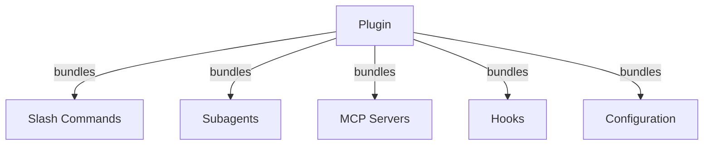
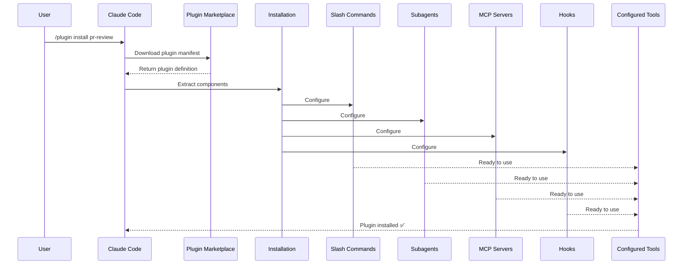
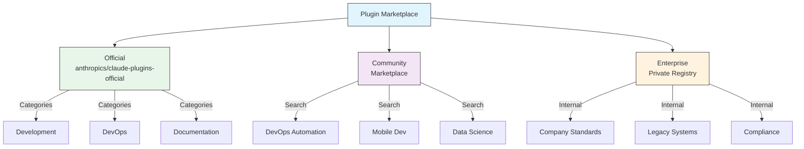
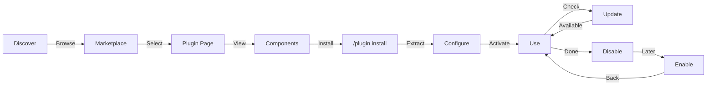
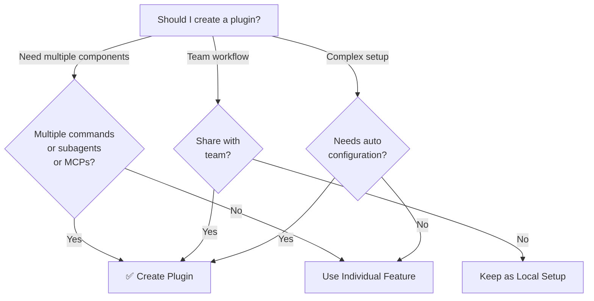

<picture>
  <source media="(prefers-color-scheme: dark)" srcset="../resources/logos/claude-howto-logo-dark.svg">
  
</picture>

# Plugins 插件

本文件夹包含完整的插件示例，将多种 Claude Code 功能打包为内聚的、可安装的软件包。

## 概述

插件是自定义功能的打包集合（包括斜杠命令、子代理、MCP 服务器和钩子）(slash commands, subagents, MCP servers, and hooks)，只需一个命令即可安装。
它们是最高级别的扩展机制，将多种功能组合成内聚的、可共享的包。

## 插件架构



## 插件加载流程



## 插件类型与分发方式

| 类型 | 作用域 | 共享对象 | 授权方 | 示例 |
|------|-------|--------|-----------|----------|
| 官方插件 | 全局 | 所有用户 | Anthropic | PR Review, Security Guidance |
| 社区插件 | 公开 | 所有用户 | 社区 | DevOps, Data Science |
| 组织插件 | 内部 | 团队成员 | 公司 | 内部规范、工具 |
| 个人插件 | 个体 | 单个用户 | 开发者 | 自定义工作流 |

## 插件定义结构

插件清单采用 JSON 格式，位于 `.claude-plugin/plugin.json` 文件中：

```json
{
  "name": "my-first-plugin",
  "description": "A greeting plugin",
  "version": "1.0.0",
  "author": {
    "name": "Your Name"
  },
  "homepage": "https://example.com",
  "repository": "https://github.com/user/repo",
  "license": "MIT"
}
```

## 插件结构示例

```
my-plugin/
├── .claude-plugin/
│   └── plugin.json       # Manifest (name, description, version, author)
├── commands/             # Skills as Markdown files
│   ├── task-1.md
│   ├── task-2.md
│   └── workflows/
├── agents/               # Custom agent definitions
│   ├── specialist-1.md
│   ├── specialist-2.md
│   └── configs/
├── skills/               # Agent Skills with SKILL.md files
│   ├── skill-1.md
│   └── skill-2.md
├── hooks/                # Event handlers in hooks.json
│   └── hooks.json
├── .mcp.json             # MCP server configurations
├── .lsp.json             # LSP server configurations for code intelligence
├── bin/                  # Executables added to Bash tool's PATH while plugin is enabled
├── settings.json         # Default settings applied when plugin is enabled (currently only `agent` key supported)
├── templates/
│   └── issue-template.md
├── scripts/
│   ├── helper-1.sh
│   └── helper-2.py
├── docs/
│   ├── README.md
│   └── USAGE.md
└── tests/
    └── plugin.test.js
```

### LSP 服务器配置

插件可包含语言服务器协议 Language Server Protocol (LSP) 支持，提供实时代码智能提示。
LSP 服务器可在你编码时提供诊断信息、代码导航及符号信息。

**配置位置**：
- 插件根目录下的 `.lsp.json` 文件
- 或 `plugin.json` 清单文件中的 `lsp` 内联键

#### LSP 字段参考

| 字段 | 是否必需 | 描述 |
|-------|----------|-------------|
| `command` | 是 | LSP 服务器二进制文件（必须在 PATH 中） |
| `extensionToLanguage` | 是 | 将文件扩展名映射到语言 ID |
| `args` | 否 | 服务器的命令行参数 |
| `transport` | 否 | 通信方式：`stdio`（默认）或 `socket` |
| `env` | 否 | 服务器进程的环境变量 |
| `initializationOptions` | 否 | LSP 初始化期间发送的选项 |
| `settings` | 否 | 传递给服务器的工作区配置 |
| `workspaceFolder` | 否 | 覆盖工作区文件夹路径 |
| `startupTimeout` | 否 | 等待服务器启动的最大时间（毫秒） |
| `shutdownTimeout` | 否 | 优雅关闭的最大等待时间（毫秒） |
| `restartOnCrash` | 否 | 服务器崩溃时自动重启 |
| `maxRestarts` | 否 | 放弃重启前的最大重启次数 |

#### 配置示例

**Go (gopls)**:

```json
{
  "go": {
    "command": "gopls",
    "args": ["serve"],
    "extensionToLanguage": {
      ".go": "go"
    }
  }
}
```

**Python (pyright)**:

```json
{
  "python": {
    "command": "pyright-langserver",
    "args": ["--stdio"],
    "extensionToLanguage": {
      ".py": "python",
      ".pyi": "python"
    }
  }
}
```

**TypeScript**:

```json
{
  "typescript": {
    "command": "typescript-language-server",
    "args": ["--stdio"],
    "extensionToLanguage": {
      ".ts": "typescript",
      ".tsx": "typescriptreact",
      ".js": "javascript",
      ".jsx": "javascriptreact"
    }
  }
}
```

#### 可用的 LSP 插件

官方市场提供了预配置的 LSP 插件：

| 插件 | 语言 | 服务器二进制文件 | 安装命令 |
|--------|----------|---------------|----------------|
| `pyright-lsp` | Python | `pyright-langserver` | `pip install pyright` |
| `typescript-lsp` | TypeScript/JavaScript | `typescript-language-server` | `npm install -g typescript-language-server typescript` |
| `rust-lsp` | Rust | `rust-analyzer` | 通过 `rustup component add rust-analyzer` 安装 |

#### LSP 能力

配置完成后，LSP 服务器将提供：

- **即时诊断**——编辑后即可即时显示错误与警告
- **代码导航**——跳转到定义、查找引用、查看实现
- **悬停信息**——悬停时显示类型签名与文档说明
- **符号列表**——浏览当前文件或工作区中的符号

## 插件选项（v2.1.83 及以上版本）

插件可在清单文件中通过 `userConfig` 声明用户可配置的选项。
标记为 `sensitive: true` 的值将存储在系统密钥链中，而非明文设置文件内：

```json
{
  "name": "my-plugin",
  "version": "1.0.0",
  "userConfig": {
    "apiKey": {
      "description": "API key for the service",
      "sensitive": true
    },
    "region": {
      "description": "Deployment region",
      "default": "us-east-1"
    }
  }
}
```

## 持久化插件数据（`${CLAUDE_PLUGIN_DATA}`）（v2.1.78 及以上版本）

插件可通过 `${CLAUDE_PLUGIN_DATA}` 环境变量访问一个持久化的状态目录。
该目录对每个插件唯一，且可跨会话保留，因此适用于缓存、数据库及其他需要持久化的状态数据：

```json
{
  "hooks": {
    "PostToolUse": [
      {
        "command": "node ${CLAUDE_PLUGIN_DATA}/track-usage.js"
      }
    ]
  }
}
```

该目录会在插件安装时自动创建。
存储在此处的文件会一直保留，直到插件被卸载。

## 通过设置文件内联定义插件（`source: 'settings'`）（v2.1.80 及以上版本）

插件可作为市场条目直接内联定义在设置文件中，使用 `source: 'settings'` 字段。
这样无需单独的仓库或市场，即可直接嵌入插件定义：

```json
{
  "pluginMarketplaces": [
    {
      "name": "inline-tools",
      "source": "settings",
      "plugins": [
        {
          "name": "quick-lint",
          "source": "./local-plugins/quick-lint"
        }
      ]
    }
  ]
}
```

## 插件设置

插件可以附带一个 `settings.json` 文件来提供默认配置。
目前支持 `agent` 字段，用于设置插件的主线程 agent：

```json
{
  "agent": "agents/specialist-1.md"
}
```

当插件包含 `settings.json` 文件时，其默认配置会在安装时生效。
用户可在自己的项目或个人配置中覆盖这些设置。

## 独立方式与插件方式对比

| 方式 | 命令名称 | 配置方式 | 适用场景 |
|----------|---------------|---|---|
| **独立** | `/hello` | 在 CLAUDE.md 中手动设置 | 个人、项目专属 |
| **插件** | `/plugin-name:hello` | 通过 plugin.json 自动配置 | 共享、分发、团队使用 |

若想快速构建个人工作流，可使用**独立的斜杠命令**。
若需打包多种功能、在团队中共享或公开发布，则使用**插件**方式。

## 实用示例

### 示例 1：PR Review 插件

**文件：** `.claude-plugin/plugin.json`

```json
{
  "name": "pr-review",
  "version": "1.0.0",
  "description": "Complete PR review workflow with security, testing, and docs",
  "author": {
    "name": "Anthropic"
  },
  "repository": "https://github.com/your-org/pr-review",
  "license": "MIT"
}
```

**文件：** `commands/review-pr.md`

```markdown
---
name: Review PR
description: Start comprehensive PR review with security and testing checks
---

# PR Review 

This command initiates a complete pull request review including:

1. Security analysis
2. Test coverage verification
3. Documentation updates
4. Code quality checks
5. Performance impact assessment
```

**文件：** `agents/security-reviewer.md`

```yaml
---
name: security-reviewer
description: Security-focused code review
tools: read, grep, diff
---

# Security Reviewer

Specializes in finding security vulnerabilities:
- Authentication/authorization issues
- Data exposure
- Injection attacks
- Secure configuration
```

**安装：**

```bash
/plugin install pr-review

# Result:
# ✅ 3 slash commands installed
# ✅ 3 subagents configured
# ✅ 2 MCP servers connected
# ✅ 4 hooks registered
# ✅ Ready to use!
```

### 示例 2：DevOps 插件

**组件：**

```
devops-automation/
├── commands/
│   ├── deploy.md
│   ├── rollback.md
│   ├── status.md
│   └── incident.md
├── agents/
│   ├── deployment-specialist.md
│   ├── incident-commander.md
│   └── alert-analyzer.md
├── mcp/
│   ├── github-config.json
│   ├── kubernetes-config.json
│   └── prometheus-config.json
├── hooks/
│   ├── pre-deploy.js
│   ├── post-deploy.js
│   └── on-error.js
└── scripts/
    ├── deploy.sh
    ├── rollback.sh
    └── health-check.sh
```

### 示例 3：文档插件

**内含组件：**

```
documentation/
├── commands/
│   ├── generate-api-docs.md
│   ├── generate-readme.md
│   ├── sync-docs.md
│   └── validate-docs.md
├── agents/
│   ├── api-documenter.md
│   ├── code-commentator.md
│   └── example-generator.md
├── mcp/
│   ├── github-docs-config.json
│   └── slack-announce-config.json
└── templates/
    ├── api-endpoint.md
    ├── function-docs.md
    └── adr-template.md
```

## Plugin Marketplace 插件市场

Anthropic 官方管理的插件目录为 `anthropics/claude-plugins-official`。
企业管理员也可创建私有插件市场，用于内部分发。



### 插件市场配置

企业用户和高级用户可通过以下设置控制市场行为：

| 设置项 | 描述 |
|---------|-------------|
| `extraKnownMarketplaces` | 在默认市场来源之外添加额外的市场 |
| `strictKnownMarketplaces` | 控制允许用户添加哪些市场 |
| `deniedPlugins` | 管理员管理的阻止列表，防止安装特定插件 |

### 插件市场其他功能

- **默认 Git 超时**: 大型插件仓库的超时时间由 30 秒增加至 120 秒
- **自定义 npm 镜像源**: 插件可指定自定义的 npm 镜像源 URL 以解析依赖
- **版本锁定**: 将插件锁定至特定版本以构建可复现的环境

### 插件市场定义模式

插件市场在 `.claude-plugin/marketplace.json` 文件中进行定义：

```json
{
  "name": "my-team-plugins",
  "owner": "my-org",
  "plugins": [
    {
      "name": "code-standards",
      "source": "./plugins/code-standards",
      "description": "Enforce team coding standards",
      "version": "1.2.0",
      "author": "platform-team"
    },
    {
      "name": "deploy-helper",
      "source": {
        "source": "github",
        "repo": "my-org/deploy-helper",
        "ref": "v2.0.0"
      },
      "description": "Deployment automation workflows"
    }
  ]
}
```

| 字段 | 是否必需 | 描述 |
|-------|----------|-------------|
| `name` | 是 | 市场名称，kebab-case 格式 |
| `owner` | 是 | 维护市场的组织或个人 |
| `plugins` | 是 | 插件条目数组 |
| `plugins[].name` | 是 | 插件名称（kebab-case 格式） |
| `plugins[].source` | 是 | 插件来源（路径字符串或来源对象） |
| `plugins[].description` | 否 | 插件的简要描述 |
| `plugins[].version` | 否 | 语义版本字符串 |
| `plugins[].author` | 否 | 插件作者名称 |

### 插件来源类型

插件可以从多种来源获取：

| 来源 | 语法 | 示例 |
|--------|--------|---------|
| **相对路径** | 字符串路径 | `"./plugins/my-plugin"` |
| **GitHub** | `{ "source": "github", "repo": "owner/repo" }` | `{ "source": "github", "repo": "acme/lint-plugin", "ref": "v1.0" }` |
| **Git URL** | `{ "source": "url", "url": "..." }` | `{ "source": "url", "url": "https://git.internal/plugin.git" }` |
| **Git 子目录** | `{ "source": "git-subdir", "url": "...", "path": "..." }` | `{ "source": "git-subdir", "url": "https://github.com/org/monorepo.git", "path": "packages/plugin" }` |
| **npm** | `{ "source": "npm", "package": "..." }` | `{ "source": "npm", "package": "@acme/claude-plugin", "version": "^2.0" }` |
| **pip** | `{ "source": "pip", "package": "..." }` | `{ "source": "pip", "package": "claude-data-plugin", "version": ">=1.0" }` |

GitHub 和 Git 源支持可选的 `ref`（分支/标签）和 `sha`（提交哈希）字段，用于版本锁定。

### 分发方式

**GitHub（推荐）**：
```bash
# Users add your marketplace
/plugin marketplace add owner/repo-name
```

**其他 Git 服务**（需提供完整 URL）：
```bash
/plugin marketplace add https://gitlab.com/org/marketplace-repo.git
```

**私有仓库**：
通过 Git 凭据助手或环境令牌支持。用户必须拥有该仓库的读取权限。

**官方市场提交**：
通过 [claude.ai/settings/plugins/submit](https://claude.ai/settings/plugins/submit) 或 [platform.claude.com/plugins/submit](https://platform.claude.com/plugins/submit) 将插件提交至 Anthropic 官方管理的市场，以进行更广泛的分发。

### 严格模式

控制市场定义与本地 `plugin.json` 文件的交互方式：

| 设置 | 行为说明 |
|---------|----------|
| `strict: true`（默认） | 本地 `plugin.json` 具有权威性；市场条目起补充作用 |
| `strict: false` | 市场条目即为完整的插件定义 |

**组织限制**（通过 `strictKnownMarketplaces` 配置）：

| 值 | 效果 |
|-------|--------|
| 未设置 | 无限制，用户可添加任意市场 |
| 空数组 `[]` | 完全锁定，不允许任何市场 |
| 模式数组 | 白名单机制，仅允许添加匹配的市场 |

```json
{
  "strictKnownMarketplaces": [
    "my-org/*",
    "github.com/trusted-vendor/*"
  ]
}
```

> **警告**：在严格模式下启用 `strictKnownMarketplaces` 时，用户仅能安装白名单市场内的插件。这对于需要受控插件分发策略的企业环境尤其有用。

## 插件安装与生命周期



## 插件功能对比

| 功能 | Slash Command | Skill | Subagent | Plugin |
|---------|---------------|-------|----------|--------|
| **安装方式** | 手动复制 | 手动复制 | 手动配置 | 一条命令 |
| **设置耗时** | 5 分钟 | 10 分钟 | 15 分钟 | 2 分钟 |
| **打包形式** | 单文件 | 单文件 | 单文件 | 多文件 |
| **版本管理** | 手动 | 手动 | 手动 | 自动 |
| **团队共享** | 复制文件 | 复制文件 | 复制文件 | 安装 ID |
| **更新方式** | 手动 | 手动 | 手动 | 自动可用 |
| **依赖项** | 无 | 无 | 无 | 可能包含 |
| **市场支持** | 否 | 否 | 否 | 是 |
| **分发方式** | 仓库 | 仓库 | 仓库 | 市场 |

## 插件 CLI 命令

所有插件操作均可通过 CLI 命令完成：

```bash
claude plugin install <name>@<marketplace>   # Install from a marketplace
claude plugin uninstall <name>               # Remove a plugin
claude plugin list                           # List installed plugins
claude plugin enable <name>                  # Enable a disabled plugin
claude plugin disable <name>                 # Disable a plugin
claude plugin validate                       # Validate plugin structure
```

## 安装方法

### 从市场安装
```bash
/plugin install plugin-name
# or from CLI:
claude plugin install plugin-name@marketplace-name
```

### 启用 / 禁用（自动检测作用域）
```bash
/plugin enable plugin-name
/plugin disable plugin-name
```

### 本地插件（用于开发）
```bash
# CLI flag for local testing (repeatable for multiple plugins)
claude --plugin-dir ./path/to/plugin
claude --plugin-dir ./plugin-a --plugin-dir ./plugin-b
```

### 从 Git 仓库安装
```bash
/plugin install github:username/repo
```

## 何时创建插件



### 插件适用场景

| 使用场景 | 建议 | 理由 |
|----------|-----------------|-----|
| **团队入职** | ✅ 使用插件 | 即时设置，完整配置到位 |
| **框架搭建** | ✅ 使用插件 | 打包框架专属命令 |
| **企业标准** | ✅ 使用插件 | 统一分发，版本受控 |
| **快速任务自动化** | ❌ 使用 Command | 复杂度方面有过度之嫌 |
| **单一领域专业知识** | ❌ 使用 Skill | 过于笨重，建议改用技能 |
| **专用分析** | ❌ 使用 Subagent | 手动创建或使用技能 |
| **实时数据访问** | ❌ 使用 MCP | 独立功能，无需捆绑 |

## 测试插件

发布前，使用 `--plugin-dir` CLI 标志在本地测试你的插件（可多次指定加载多个插件）：

```bash
claude --plugin-dir ./my-plugin
claude --plugin-dir ./my-plugin --plugin-dir ./another-plugin
```

这将通过加载你的插件来启动 Claude Code，以便你完成以下操作：
- 验证所有斜杠命令是否可用
- 测试子代理及代理功能是否正常运行
- 确认 MCP 服务器连接无误
- 验证钩子的执行情况
- 检查 LSP 服务器配置
- 排查是否存在配置错误

## 热重载

插件在开发过程中支持热重载。
当你修改插件文件时，Claude Code 能够自动检测到变更。
你也可以通过以下命令强制重载：

```bash
/reload-plugins
```

这会重新读取所有插件清单 manifests、命令 commands、代理 agents、技能 skills、钩子 hooks 以及 MCP/LSP 配置，无需重启会话。

## 插件的托管设置

管理员可通过托管设置控制整个组织内的插件行为：

| 设置项 | 描述 |
|---------|-------------|
| `enabledPlugins` | 默认启用的插件白名单 |
| `deniedPlugins` | 禁止安装的插件黑名单 |
| `extraKnownMarketplaces` | 在默认市场来源之外添加额外的市场 |
| `strictKnownMarketplaces` | 限制允许用户添加哪些市场 |
| `allowedChannelPlugins` | 按发布渠道控制允许哪些插件 |

这些设置可通过托管配置文件应用于组织级别，其优先级高于用户级设置。

## 插件安全性

插件子代理在受限的沙盒环境中运行。
插件子代理定义中**不允许**使用以下前言元数据字段：

- `hooks` -- 子代理无法注册事件处理器
- `mcpServers` -- 子代理无法配置 MCP 服务器
- `permissionMode` -- 子代理无法覆盖权限模式

这确保了插件无法在其声明范围之外提升权限或修改主机环境。

## 发布插件

**发布步骤：**

1. 创建包含所有组件的插件结构
2. 编写 `.claude-plugin/plugin.json` 清单文件
3. 创建附带文档的 `README.md`
4. 使用 `claude --plugin-dir ./my-plugin` 进行本地测试
5. 提交至插件市场
6. 接受审核并获得批准
7. 在市场发布
8. 用户可通过一条命令完成安装

**提交示例：**

```markdown
# PR Review Plugin

## Description
Complete PR review workflow with security, testing, and documentation checks.

## What's Included
- 3 slash commands for different review types
- 3 specialized subagents
- GitHub and CodeQL MCP integration
- Automated security scanning hooks

## Installation
```bash
/plugin install pr-review
```

## Features
✅ Security analysis
✅ Test coverage checking
✅ Documentation verification
✅ Code quality assessment
✅ Performance impact analysis

## Usage
```bash
/review-pr
/check-security
/check-tests
```

## Requirements
- Claude Code 1.0+
- GitHub access
- CodeQL (optional)
```

## 插件与手动配置对比

**手动配置（需 2 小时以上）：**
- 逐个安装斜杠命令
- 分别创建子代理
- 单独配置 MCP 服务器
- 手动设置各类钩子
- 编写所有文档
- 分享给团队（并期望他们能正确配置）

**使用插件（仅需 2 分钟）：**
```bash
/plugin install pr-review
# ✅ Everything installed and configured
# ✅ Ready to use immediately
# ✅ Team can reproduce exact setup
```

## 最佳实践

### 建议事项 ✅
- 使用清晰、描述性的插件名称
- 包含详尽的 README 文档
- 合理进行版本管理（遵循语义化版本规范）
- 对所有组件进行集成测试
- 明确列出使用要求
- 提供使用示例
- 包含错误处理逻辑
- 使用恰当的标签以便于发现
- 保持向后兼容性
- 使插件功能聚焦且内聚
- 包含全面的测试
- 记录所有依赖项

### 避免事项 ❌
- 不要捆绑不相关的功能
- 不要硬编码凭据
- 不要跳过测试环节
- 不要忽略文档编写
- 不要创建重复冗余的插件
- 不要忽视版本管理
- 不要使组件依赖关系过度复杂
- 不要忘记进行优雅的错误处理

## 安装指南

### 从市场安装

1. **浏览可用插件：**
   ```bash
   /plugin list
   ```

2. **查看插件详情：**
   ```bash
   /plugin info plugin-name
   ```

3. **安装插件：**
   ```bash
   /plugin install plugin-name
   ```

### 从本地路径安装

```bash
/plugin install ./path/to/plugin-directory
```

### 从 GitHub 安装

```bash
/plugin install github:username/repo
```

### 列出已安装的插件

```bash
/plugin list --installed
```

### 更新插件

```bash
/plugin update plugin-name
```

### 禁用/启用插件

```bash
# Temporarily disable
/plugin disable plugin-name

# Re-enable
/plugin enable plugin-name
```

### 卸载插件

```bash
/plugin uninstall plugin-name
```

## 相关概念

以下 Claude Code 功能可与插件协同工作：

- **[Slash Commands](../01-slash-commands/)** - 插件中集成的独立命令
- **[Memory](../02-memory/)** - 插件的持久化上下文
- **[Skills](../03-skills/)** - 可封装为插件的领域专业知识
- **[Subagents](../04-subagents/)** - 作为插件组件包含的专用代理
- **[MCP Servers](../05-mcp/)** - 插件中集成的模型上下文协议集成
- **[Hooks](../06-hooks/)** - 触发插件工作流的事件处理器

## 完整示例工作流

### PR Review 审查插件完整工作流

```
1. User: /review-pr

2. Plugin executes:
   ├── pre-review.js hook validates git repo
   ├── GitHub MCP fetches PR data
   ├── security-reviewer subagent analyzes security
   ├── test-checker subagent verifies coverage
   └── performance-analyzer subagent checks performance

3. Results synthesized and presented:
   ✅ Security: No critical issues
   ⚠️  Testing: Coverage 65% (recommend 80%+)
   ✅ Performance: No significant impact
   📝 12 recommendations provided
```

## 故障排查

### 插件无法安装
- 检查 Claude Code 版本兼容性：`/version`
- 使用 JSON 验证工具检查 `plugin.json` 语法是否正确
- 检查网络连接（用于远程插件）
- 检查权限设置：`ls -la plugin/`

### 组件未加载
- 确认 `plugin.json` 中的路径与实际目录结构是否匹配
- 检查文件权限：`chmod +x scripts/`
- 检查组件的文件语法
- 查看日志：`/plugin debug plugin-name`

### MCP 连接失败
- 确认环境变量设置是否正确
- 检查 MCP 服务器的安装及运行状况
- 使用 `/mcp test` 独立测试 MCP 连接
- 检查 `mcp/` 目录下的 MCP 配置

### 安装后 Commands 命令不可用
- 确认插件已成功安装：`/plugin list --installed`
- 检查插件是否已启用：`/plugin status plugin-name`
- 重启 Claude Code：执行 `exit` 后重新打开
- 检查是否存在与现有命令的命名冲突

### Hook 钩子执行问题
- 确认钩子文件拥有正确的执行权限
- 检查钩子的语法及事件名称
- 查看钩子日志以获取详细错误信息
- 如条件允许，手动测试钩子功能

## 其他资源

- [Official Plugins Documentation](https://code.claude.com/docs/en/plugins)
- [Discover Plugins](https://code.claude.com/docs/en/discover-plugins)
- [Plugin Marketplaces](https://code.claude.com/docs/en/plugin-marketplaces)
- [Plugins Reference](https://code.claude.com/docs/en/plugins-reference)
- [MCP Server Reference](https://modelcontextprotocol.io/)
- [Subagent Configuration Guide](../04-subagents/README.md)
- [Hook System Reference](../06-hooks/README.md)

---
**Last Updated**: April 2026
**Claude Code Version**: 2.1+
**Compatible Models**: Claude Sonnet 4.6, Claude Opus 4.6, Claude Haiku 4.5
