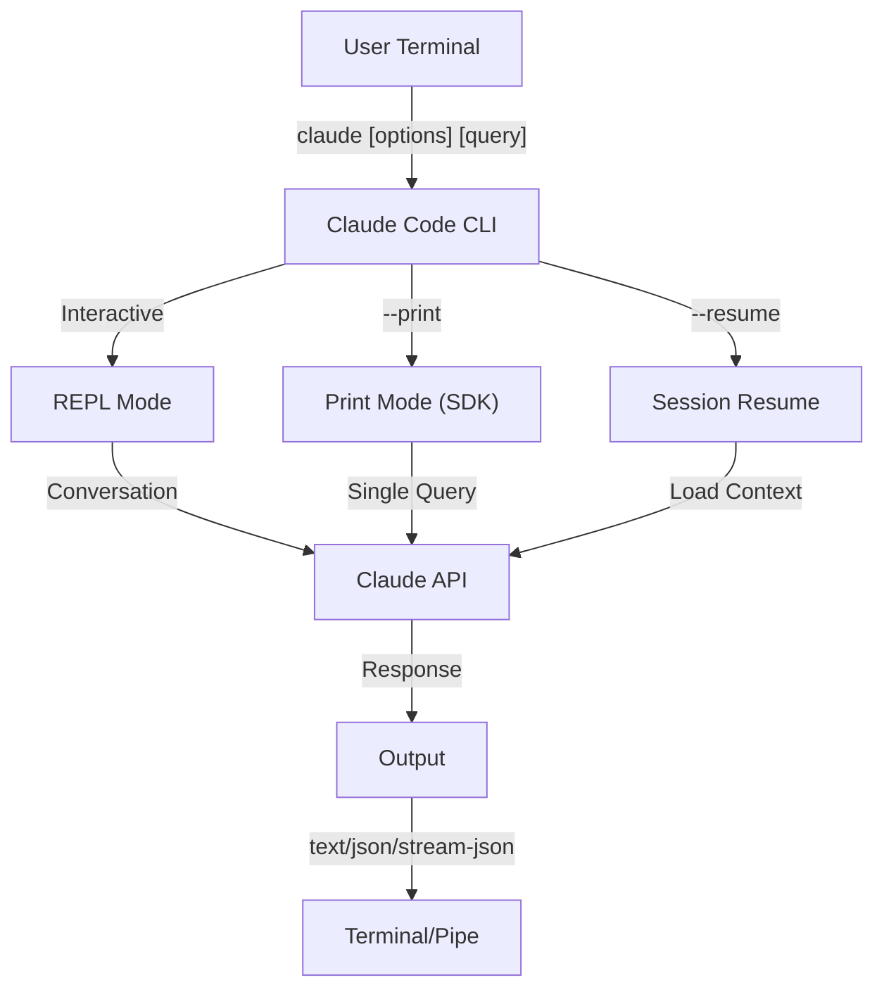
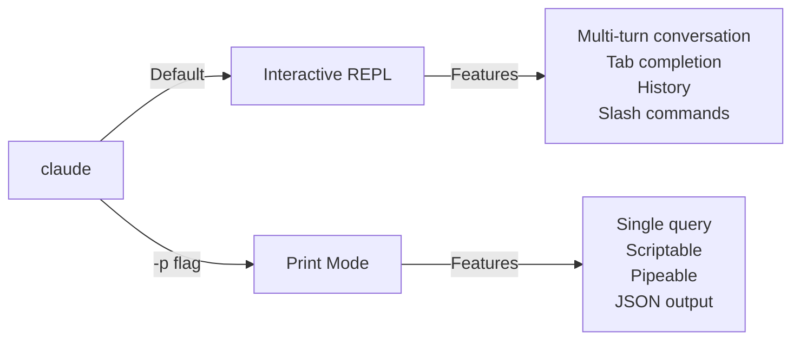

<picture>
  <source media="(prefers-color-scheme: dark)" srcset="../resources/logos/claude-howto-logo-dark.svg">
  
</picture>

# CLI 参考

## 概述

Claude Code CLI (Command Line Interface) （命令行界面） 是与 Claude Code 交互的主要方式。
它提供了强大的选项，用于运行查询、管理会话、配置模型以及将 Claude 集成到您的开发工作流中。

## 架构



## CLI 命令

| 命令 | 描述 | 示例 |
|---------|-------------|---------|
| `claude` | 启动交互式 REPL | `claude` |
| `claude "query"` | 以初始提示词启动 REPL | `claude "解释这个项目"` |
| `claude -p "query"` | 打印模式，查询后退出 | `claude -p "解释这个函数"` |
| `cat file \| claude -p "query"` | 处理管道传入的内容 | `cat logs.txt \| claude -p "解释"` |
| `claude -c` | 继续最近的对话 | `claude -c` |
| `claude -c -p "query"` | 以打印模式继续对话 | `claude -c -p "检查类型错误"` |
| `claude -r "<session>" "query"` | 通过 ID 或名称恢复会话 | `claude -r "auth-refactor" "完成这个 PR"` |
| `claude update` | 更新至最新版本 | `claude update` |
| `claude mcp` | 配置 MCP 服务器 | 参阅 [MCP 文档](../05-mcp/) |
| `claude mcp serve` | 将 Claude Code 作为 MCP 服务器运行 | `claude mcp serve` |
| `claude agents` | 列出所有已配置的子代理 | `claude agents` |
| `claude auto-mode defaults` | 以 JSON 格式打印自动模式的默认规则 | `claude auto-mode defaults` |
| `claude remote-control` | 启动远程控制服务器 | `claude remote-control` |
| `claude plugin` | 管理插件（安装、启用、禁用） | `claude plugin install my-plugin` |
| `claude auth login` | 登录（支持 `--email`、`--sso` 标志） | `claude auth login --email user@example.com` |
| `claude auth logout` | 注销当前账户 | `claude auth logout` |
| `claude auth status` | 检查认证状态（登录则退出码为 0，否则为 1） | `claude auth status` |

## 核心标志

| 标志 | 描述 | 示例 |
|------|-------------|---------|
| `-p, --print` | 在非交互模式下输出回复 | `claude -p "query"` |
| `-c, --continue` | 加载最近的对话 | `claude --continue` |
| `-r, --resume` | 按 ID 或名称恢复特定会话 | `claude --resume auth-refactor` |
| `-v, --version` | 输出版本号 | `claude -v` |
| `-w, --worktree` | 在隔离的 git 工作树中启动 | `claude -w` |
| `-n, --name` | 会话显示名称 | `claude -n "auth-refactor"` |
| `--from-pr <number>` | 恢复关联到 GitHub PR 的会话 | `claude --from-pr 42` |
| `--remote "task"` | 在 claude.ai 上创建 Web 会话 | `claude --remote "实现 API"` |
| `--remote-control, --rc` | 带远程控制的交互式会话 | `claude --rc` |
| `--teleport` | 在本地恢复 Web 会话 | `claude --teleport` |
| `--teammate-mode` | 代理团队显示模式 | `claude --teammate-mode tmux` |
| `--bare` | 最小模式（跳过钩子、技能、插件、MCP、自动记忆、CLAUDE.md） | `claude --bare` |
| `--enable-auto-mode` | 解锁自动权限模式 | `claude --enable-auto-mode` |
| `--channels` | 订阅 MCP 频道插件 | `claude --channels discord,telegram` |
| `--chrome` / `--no-chrome` | 启用/禁用 Chrome 浏览器集成 | `claude --chrome` |
| `--effort` | 设置思考深度级别 | `claude --effort high` |
| `--init` / `--init-only` | 运行初始化钩子 | `claude --init` |
| `--maintenance` | 运行维护钩子后退出 | `claude --maintenance` |
| `--disable-slash-commands` | 禁用所有技能和斜杠命令 | `claude --disable-slash-commands` |
| `--no-session-persistence` | 禁用会话保存（打印模式） | `claude -p --no-session-persistence "query"` |

### 交互模式 vs 打印模式



**交互模式**（默认）：
```bash
# Start interactive session
claude

# Start with initial prompt
claude "explain the authentication flow"
```

**打印模式**（非交互式）：
```bash
# Single query, then exit
claude -p "what does this function do?"

# Process file content
cat error.log | claude -p "explain this error"

# Chain with other tools
claude -p "list todos" | grep "URGENT"
```

## 模型与配置

| 标志 | 描述 | 示例 |
|------|-------------|---------|
| `--model` | 设置模型（sonnet、opus、haiku 或完整模型名） | `claude --model opus` |
| `--fallback-model` | 模型过载时自动回退到指定模型 | `claude -p --fallback-model sonnet "query"` |
| `--agent` | 指定会话使用的代理 | `claude --agent my-custom-agent` |
| `--agents` | 通过 JSON 定义自定义子代理 | 见[代理配置](#代理配置) |
| `--effort` | 设置思考强度（low、medium、high、max） | `claude --effort high` |


### 模型选择示例

```bash
# Use Opus 4.6 for complex tasks
claude --model opus "design a caching strategy"

# Use Haiku 4.5 for quick tasks
claude --model haiku -p "format this JSON"

# Full model name
claude --model claude-sonnet-4-6-20250929 "review this code"

# With fallback for reliability
claude -p --model opus --fallback-model sonnet "analyze architecture"

# Use opusplan (Opus plans, Sonnet executes)
claude --model opusplan "design and implement the caching layer"
```

## 系统提示词自定义

| 标志 | 描述 | 示例 |
|------|-------------|---------|
| `--system-prompt` | 替换整个默认提示词 | `claude --system-prompt "你是一名 Python 专家"` |
| `--system-prompt-file` | 从文件加载提示词（打印模式） | `claude -p --system-prompt-file ./prompt.txt "query"` |
| `--append-system-prompt` | 追加至默认提示词末尾 | `claude --append-system-prompt "始终使用 TypeScript"` |

### 系统提示词示例

```bash
# Complete custom persona
claude --system-prompt "You are a senior security engineer. Focus on vulnerabilities."

# Append specific instructions
claude --append-system-prompt "Always include unit tests with code examples"

# Load complex prompt from file
claude -p --system-prompt-file ./prompts/code-reviewer.txt "review main.py"
```

### 系统提示词标志对比

| 标志 | 行为说明 | 交互模式 | 打印模式 |
|------|----------|-------------|-------|
| `--system-prompt` | 替换整个默认系统提示词 | ✅ | ✅ |
| `--system-prompt-file` | 用文件内容替换系统提示词 | ❌ | ✅ |
| `--append-system-prompt` | 追加至默认系统提示词末尾 | ✅ | ✅ |

**`--system-prompt-file` 仅限打印模式使用。交互模式下，请使用 `--system-prompt` 或 `--append-system-prompt`。**

## 工具与权限管理

| 标志 | 描述 | 示例 |
|------|-------------|---------|
| `--tools` | 限制可用的内置工具 | `claude -p --tools "Bash,Edit,Read" "query"` |
| `--allowedTools` | 无需提示即可执行的操作 | `"Bash(git log:*)" "Read"` |
| `--disallowedTools` | 从上下文中移除的工具 | `"Bash(rm:*)" "Edit"` |
| `--dangerously-skip-permissions` | 跳过所有权限询问 | `claude --dangerously-skip-permissions` |
| `--permission-mode` | 以指定权限模式启动 | `claude --permission-mode auto` |
| `--permission-prompt-tool` | 用于权限处理的 MCP 工具 | `claude -p --permission-prompt-tool mcp_auth "query"` |
| `--enable-auto-mode` | 解锁自动权限模式 | `claude --enable-auto-mode` |

### 权限示例

```bash
# Read-only mode for code review
claude --permission-mode plan "review this codebase"

# Restrict to safe tools only
claude --tools "Read,Grep,Glob" -p "find all TODO comments"

# Allow specific git commands without prompts
claude --allowedTools "Bash(git status:*)" "Bash(git log:*)"

# Block dangerous operations
claude --disallowedTools "Bash(rm -rf:*)" "Bash(git push --force:*)"
```

## 输出与格式

| 标志 | 描述 | 选项 | 示例 |
|------|-------------|---------|---------|
| `--output-format` | 指定输出格式（打印模式） | `text`、`json`、`stream-json` | `claude -p --output-format json "query"` |
| `--input-format` | 指定输入格式（打印模式） | `text`、`stream-json` | `claude -p --input-format stream-json` |
| `--verbose` | 启用详细日志记录 | | `claude --verbose` |
| `--include-partial-messages` | 包含流事件（需要 `stream-json`） | 需配合 `stream-json` | `claude -p --output-format stream-json --include-partial-messages "query"` |
| `--json-schema` | 获取与指定 JSON 模式匹配且经过验证的 JSON | | `claude -p --json-schema '{"type":"object"}' "query"` |
| `--max-budget-usd` | 打印模式下的最高费用限额 | | `claude -p --max-budget-usd 5.00 "query"` |

### 输出格式示例

```bash
# Plain text (default)
claude -p "explain this code"

# JSON for programmatic use
claude -p --output-format json "list all functions in main.py"

# Streaming JSON for real-time processing
claude -p --output-format stream-json "generate a long report"

# Structured output with schema validation
claude -p --json-schema '{"type":"object","properties":{"bugs":{"type":"array"}}}' \
  "find bugs in this code and return as JSON"
```

## 工作空间与目录

| 标志 | 描述 | 示例 |
|------|-------------|---------|
| `--add-dir` | 添加额外的工作目录 | `claude --add-dir ../apps ../lib` |
| `--setting-sources` | 逗号分隔的设置来源 | `claude --setting-sources user,project` |
| `--settings` | 从文件或 JSON 字符串加载设置 | `claude --settings ./settings.json` |
| `--plugin-dir` | 从指定目录加载插件（可多次使用） | `claude --plugin-dir ./my-plugin` |

### 多目录示例

```bash
# Work across multiple project directories
claude --add-dir ../frontend ../backend ../shared "find all API endpoints"

# Load custom settings
claude --settings '{"model":"opus","verbose":true}' "complex task"
```

## MCP 配置

| 标志 | 描述 | 示例 |
|------|-------------|---------|
| `--mcp-config` | 从 JSON 文件加载 MCP 服务器 | `claude --mcp-config ./mcp.json` |
| `--strict-mcp-config` | 仅使用指定的 MCP 配置 | `claude --strict-mcp-config --mcp-config ./mcp.json` |
| `--channels` | 订阅 MCP 频道插件 | `claude --channels discord,telegram` |

### MCP 示例

```bash
# Load GitHub MCP server
claude --mcp-config ./github-mcp.json "list open PRs"

# Strict mode - only specified servers
claude --strict-mcp-config --mcp-config ./production-mcp.json "deploy to staging"
```

## 会话管理

| 标志 | 描述 | 示例 |
|------|-------------|---------|
| `--session-id` | 使用特定的会话 ID（UUID） | `claude --session-id "550e8400-..."` |
| `--fork-session` | 在恢复会话时创建新会话 | `claude --resume abc123 --fork-session` |

### 会话示例

```bash
# Continue last conversation
claude -c

# Resume named session
claude -r "feature-auth" "continue implementing login"

# Fork session for experimentation
claude --resume feature-auth --fork-session "try alternative approach"

# Use specific session ID
claude --session-id "550e8400-e29b-41d4-a716-446655440000" "continue"
```

### 会话分叉

从已有会话创建一个分支用于实验探索：

```bash
# Fork a session to try a different approach
claude --resume abc123 --fork-session "try alternative implementation"

# Fork with a custom message
claude -r "feature-auth" --fork-session "test with different architecture"
```

**使用场景：**  
- 在不影响原始会话的情况下尝试替代实现方案  
- 并行尝试不同的方法  
- 从成功的工作中创建分支以探索变体  
- 在不影响主会话的情况下测试破坏性更改  

原始会话保持不变，分叉操作会创建一个新的独立会话。

## 高级功能

| 标志 | 描述 | 示例 |
|------|-------------|---------|
| `--chrome` | 启用 Chrome 浏览器集成 | `claude --chrome` |
| `--no-chrome` | 禁用 Chrome 浏览器集成 | `claude --no-chrome` |
| `--ide` | 若 IDE 可用则自动连接 | `claude --ide` |
| `--max-turns` | 限制代理轮次（非交互模式） | `claude -p --max-turns 3 "query"` |
| `--debug` | 启用调试模式并可筛选 | `claude --debug "api,mcp"` |
| `--enable-lsp-logging` | 启用详细的 LSP 日志 | `claude --enable-lsp-logging` |
| `--betas` | 为 API 请求添加 Beta 标头 | `claude --betas interleaved-thinking` |
| `--plugin-dir` | 从目录加载插件（可多次指定） | `claude --plugin-dir ./my-plugin` |
| `--enable-auto-mode` | 解锁自动权限模式 | `claude --enable-auto-mode` |
| `--effort` | 设置思考强度级别 | `claude --effort high` |
| `--bare` | 纯净模式（跳过钩子、技能、插件、MCP、自动记忆、CLAUDE.md） | `claude --bare` |
| `--channels` | 订阅 MCP 频道插件 | `claude --channels discord` |
| `--tmux` | 为工作树创建 tmux 会话 | `claude --tmux` |
| `--fork-session` | 恢复会话时创建新的会话 ID | `claude --resume abc --fork-session` |
| `--max-budget-usd` | 最高费用限额（打印模式） | `claude -p --max-budget-usd 5.00 "query"` |
| `--json-schema` | 经过验证的 JSON 输出 | `claude -p --json-schema '{"type":"object"}' "query"` |

### 高级功能示例

```bash
# Limit autonomous actions
claude -p --max-turns 5 "refactor this module"

# Debug API calls
claude --debug "api" "test query"

# Enable IDE integration
claude --ide "help me with this file"
```

## 代理配置

通过 `--agents` 标志接受一个 JSON 对象，用于为会话定义自定义子代理。

### Agents JSON 格式

```json
{
  "agent-name": {
    "description": "Required: when to invoke this agent",
    "prompt": "Required: system prompt for the agent",
    "tools": ["Optional", "array", "of", "tools"],
    "model": "optional: sonnet|opus|haiku"
  }
}
```

**必填字段：**
- `description` - 描述何时使用该代理的自然语言描述
- `prompt` - 定义代理角色和行为的系统提示词

**可选字段：**
- `tools` - 可用工具数组（省略则继承全部）
  - 格式：`["Read", "Grep", "Glob", "Bash"]`
- `model` - 使用的模型：`sonnet`、`opus` 或 `haiku`

### 完整 Agents 代理示例

```json
{
  "code-reviewer": {
    "description": "Expert code reviewer. Use proactively after code changes.",
    "prompt": "You are a senior code reviewer. Focus on code quality, security, and best practices.",
    "tools": ["Read", "Grep", "Glob", "Bash"],
    "model": "sonnet"
  },
  "debugger": {
    "description": "Debugging specialist for errors and test failures.",
    "prompt": "You are an expert debugger. Analyze errors, identify root causes, and provide fixes.",
    "tools": ["Read", "Edit", "Bash", "Grep"],
    "model": "opus"
  },
  "documenter": {
    "description": "Documentation specialist for generating guides.",
    "prompt": "You are a technical writer. Create clear, comprehensive documentation.",
    "tools": ["Read", "Write"],
    "model": "haiku"
  }
}
```

### Agents 命令示例

```bash
# Define custom agents inline
claude --agents '{
  "security-auditor": {
    "description": "Security specialist for vulnerability analysis",
    "prompt": "You are a security expert. Find vulnerabilities and suggest fixes.",
    "tools": ["Read", "Grep", "Glob"],
    "model": "opus"
  }
}' "audit this codebase for security issues"

# Load agents from file
claude --agents "$(cat ~/.claude/agents.json)" "review the auth module"

# Combine with other flags
claude -p --agents "$(cat agents.json)" --model sonnet "analyze performance"
```

### Agent 优先级

当存在多个代理定义时，按以下优先级顺序加载：
1. **CLI 定义的**（`--agents` 标志）-- 会话级别
2. **用户级别的**（`~/.claude/agents/`）-- 所有项目
3. **项目级别的**（`.claude/agents/`）-- 当前项目

CLI 定义的代理会覆盖该会话中的用户代理和项目代理。

---

## 高价值使用场景

### 1. CI/CD 集成

在 CI/CD 流水线中使用 Claude Code，实现自动化代码审查、测试和文档生成。

**GitHub Actions 示例:**

```yaml
name: AI Code Review

on: [pull_request]

jobs:
  review:
    runs-on: ubuntu-latest
    steps:
      - uses: actions/checkout@v4

      - name: Install Claude Code
        run: npm install -g @anthropic-ai/claude-code

      - name: Run Code Review
        env:
          ANTHROPIC_API_KEY: ${{ secrets.ANTHROPIC_API_KEY }}
        run: |
          claude -p --output-format json \
            --max-turns 1 \
            "Review the changes in this PR for:
            - Security vulnerabilities
            - Performance issues
            - Code quality
            Output as JSON with 'issues' array" > review.json

      - name: Post Review Comment
        uses: actions/github-script@v7
        with:
          script: |
            const fs = require('fs');
            const review = JSON.parse(fs.readFileSync('review.json', 'utf8'));
            // Process and post review comments
```

**Jenkins 流水线：**

```groovy
pipeline {
    agent any
    stages {
        stage('AI Review') {
            steps {
                sh '''
                    claude -p --output-format json \
                      --max-turns 3 \
                      "Analyze test coverage and suggest missing tests" \
                      > coverage-analysis.json
                '''
            }
        }
    }
}
```

### 2. 脚本管道

通过 Claude 处理文件、日志和数据以进行分析。

**Log 分析:**

```bash
# Analyze error logs
tail -1000 /var/log/app/error.log | claude -p "summarize these errors and suggest fixes"

# Find patterns in access logs
cat access.log | claude -p "identify suspicious access patterns"

# Analyze git history
git log --oneline -50 | claude -p "summarize recent development activity"
```

**代码处理：**

```bash
# Review a specific file
cat src/auth.ts | claude -p "review this authentication code for security issues"

# Generate documentation
cat src/api/*.ts | claude -p "generate API documentation in markdown"

# Find TODOs and prioritize
grep -r "TODO" src/ | claude -p "prioritize these TODOs by importance"
```

### 3. 多会话工作流

通过多个对话线程管理复杂项目。

```bash
# Start a feature branch session
claude -r "feature-auth" "let's implement user authentication"

# Later, continue the session
claude -r "feature-auth" "add password reset functionality"

# Fork to try an alternative approach
claude --resume feature-auth --fork-session "try OAuth instead"

# Switch between different feature sessions
claude -r "feature-payments" "continue with Stripe integration"
```

### 4. 自定义Agent代理配置

为团队的工作流定义专用Agent代理。

```bash
# Save agents config to file
cat > ~/.claude/agents.json << 'EOF'
{
  "reviewer": {
    "description": "Code reviewer for PR reviews",
    "prompt": "Review code for quality, security, and maintainability.",
    "model": "opus"
  },
  "documenter": {
    "description": "Documentation specialist",
    "prompt": "Generate clear, comprehensive documentation.",
    "model": "sonnet"
  },
  "refactorer": {
    "description": "Code refactoring expert",
    "prompt": "Suggest and implement clean code refactoring.",
    "tools": ["Read", "Edit", "Glob"]
  }
}
EOF

# Use agents in session
claude --agents "$(cat ~/.claude/agents.json)" "review the auth module"
```

### 5. 批量处理

使用一致的设置处理多个查询。

```bash
# Process multiple files
for file in src/*.ts; do
  echo "Processing $file..."
  claude -p --model haiku "summarize this file: $(cat $file)" >> summaries.md
done

# Batch code review
find src -name "*.py" -exec sh -c '
  echo "## $1" >> review.md
  cat "$1" | claude -p "brief code review" >> review.md
' _ {} \;

# Generate tests for all modules
for module in $(ls src/modules/); do
  claude -p "generate unit tests for src/modules/$module" > "tests/$module.test.ts"
done
```

### 6. 注重安全的开发

使用权限控制以确保安全操作。

```bash
# Read-only security audit
claude --permission-mode plan \
  --tools "Read,Grep,Glob" \
  "audit this codebase for security vulnerabilities"

# Block dangerous commands
claude --disallowedTools "Bash(rm:*)" "Bash(curl:*)" "Bash(wget:*)" \
  "help me clean up this project"

# Restricted automation
claude -p --max-turns 2 \
  --allowedTools "Read" "Glob" \
  "find all hardcoded credentials"
```

### 7. JSON API 集成

将 Claude 作为可编程 API 用于你的工具，并结合 `jq` 进行解析。

```bash
# Get structured analysis
claude -p --output-format json \
  --json-schema '{"type":"object","properties":{"functions":{"type":"array"},"complexity":{"type":"string"}}}' \
  "analyze main.py and return function list with complexity rating"

# Integrate with jq for processing
claude -p --output-format json "list all API endpoints" | jq '.endpoints[]'

# Use in scripts
RESULT=$(claude -p --output-format json "is this code secure? answer with {secure: boolean, issues: []}" < code.py)
if echo "$RESULT" | jq -e '.secure == false' > /dev/null; then
  echo "Security issues found!"
  echo "$RESULT" | jq '.issues[]'
fi
```

### jq 解析示例

使用 `jq` 解析并处理 Claude 的 JSON 输出：

```bash
# Extract specific fields
claude -p --output-format json "analyze this code" | jq '.result'

# Filter array elements
claude -p --output-format json "list issues" | jq -r '.issues[] | select(.severity=="high")'

# Extract multiple fields
claude -p --output-format json "describe the project" | jq -r '.{name, version, description}'

# Convert to CSV
claude -p --output-format json "list functions" | jq -r '.functions[] | [.name, .lineCount] | @csv'

# Conditional processing
claude -p --output-format json "check security" | jq 'if .vulnerabilities | length > 0 then "UNSAFE" else "SAFE" end'

# Extract nested values
claude -p --output-format json "analyze performance" | jq '.metrics.cpu.usage'

# Process entire array
claude -p --output-format json "find todos" | jq '.todos | length'

# Transform output
claude -p --output-format json "list improvements" | jq 'map({title: .title, priority: .priority})'
```

---

## 模型

Claude Code 支持多种模型，各自具有不同的能力：

| 模型 | ID | 上下文窗口 | 备注 |
|-------|-----|----------------|-------|
| Opus 4.6 | `claude-opus-4-6` | 100 万 Token | 能力最强，自适应思考级别 |
| Sonnet 4.6 | `claude-sonnet-4-6` | 100 万 Token | 速度与能力的平衡 |
| Haiku 4.5 | `claude-haiku-4-5` | 100 万 Token | 速度最快，最适合快速任务 |

### 模型选择

```bash
# Use short names
claude --model opus "complex architectural review"
claude --model sonnet "implement this feature"
claude --model haiku -p "format this JSON"

# Use opusplan alias (Opus plans, Sonnet executes)
claude --model opusplan "design and implement the API"

# Toggle fast mode during session
/fast
```

### 工作强度级别（Opus 4.6）

Opus 4.6 支持自适应推理，可设定不同的工作强度级别：

```bash
# Set effort level via CLI flag
claude --effort high "complex review"

# Set effort level via slash command
/effort high

# Set effort level via environment variable
export CLAUDE_CODE_EFFORT_LEVEL=high   # low, medium, high, or max (Opus 4.6 only)
```

提示词中出现 "ultrathink" 关键词可激活深度推理模式。`max` 工作强度级别为 Opus 4.6 专属。

---

## 关键环境变量

| 变量 | 描述 |
|----------|-------------|
| `ANTHROPIC_API_KEY` | 用于身份验证的 API 密钥 |
| `ANTHROPIC_MODEL` | 覆盖默认模型 |
| `ANTHROPIC_CUSTOM_MODEL_OPTION` | API 的自定义模型选项 |
| `ANTHROPIC_DEFAULT_OPUS_MODEL` | 覆盖默认的 Opus 模型 ID |
| `ANTHROPIC_DEFAULT_SONNET_MODEL` | 覆盖默认的 Sonnet 模型 ID |
| `ANTHROPIC_DEFAULT_HAIKU_MODEL` | 覆盖默认的 Haiku 模型 ID |
| `MAX_THINKING_TOKENS` | 设置扩展思维的 token 预算 |
| `CLAUDE_CODE_EFFORT_LEVEL` | 设置工作强度级别（`low`/`medium`/`high`/`max`） |
| `CLAUDE_CODE_SIMPLE` | 最小模式，由 `--bare` 标志设置 |
| `CLAUDE_CODE_DISABLE_AUTO_MEMORY` | 禁用自动 CLAUDE.md 更新 |
| `CLAUDE_CODE_DISABLE_BACKGROUND_TASKS` | 禁用后台任务执行 |
| `CLAUDE_CODE_DISABLE_CRON` | 禁用定时/cron 任务 |
| `CLAUDE_CODE_DISABLE_GIT_INSTRUCTIONS` | 禁用 Git 相关指令 |
| `CLAUDE_CODE_DISABLE_TERMINAL_TITLE` | 禁用终端标题更新 |
| `CLAUDE_CODE_DISABLE_1M_CONTEXT` | 禁用 100 万 token 上下文窗口 |
| `CLAUDE_CODE_DISABLE_NONSTREAMING_FALLBACK` | 禁用非流式回退 |
| `CLAUDE_CODE_ENABLE_TASKS` | 启用任务列表功能 |
| `CLAUDE_CODE_TASK_LIST_ID` | 跨会话共享的命名任务目录 |
| `CLAUDE_CODE_ENABLE_PROMPT_SUGGESTION` | 切换提示建议功能（`true`/`false`） |
| `CLAUDE_CODE_EXPERIMENTAL_AGENT_TEAMS` | 启用实验性代理团队 |
| `CLAUDE_CODE_NEW_INIT` | 使用新的初始化流程 |
| `CLAUDE_CODE_SUBAGENT_MODEL` | 子代理执行的模型 |
| `CLAUDE_CODE_PLUGIN_SEED_DIR` | 插件种子文件目录 |
| `CLAUDE_CODE_SUBPROCESS_ENV_SCRUB` | 要从子进程中清除的环境变量 |
| `CLAUDE_AUTOCOMPACT_PCT_OVERRIDE` | 覆盖自动压缩百分比 |
| `CLAUDE_STREAM_IDLE_TIMEOUT_MS` | 流空闲超时时间（毫秒） |
| `SLASH_COMMAND_TOOL_CHAR_BUDGET` | 斜杠命令工具的字符预算 |
| `ENABLE_TOOL_SEARCH` | 启用工具搜索能力 |
| `MAX_MCP_OUTPUT_TOKENS` | MCP 工具输出的最大 token 数 |

---

## 快速参考

### 常用命令

```bash
# Interactive session
claude

# Quick question
claude -p "how do I..."

# Continue conversation
claude -c

# Process a file
cat file.py | claude -p "review this"

# JSON output for scripts
claude -p --output-format json "query"
```

### 标志组合

| 使用场景 | 命令 |
|----------|---------|
| 快速代码审查 | `cat file \| claude -p "review"` |
| 结构化输出 | `claude -p --output-format json "query"` |
| 安全探索 | `claude --permission-mode plan` |
| 安全的自主操作 | `claude --enable-auto-mode --permission-mode auto` |
| CI/CD 集成 | `claude -p --max-turns 3 --output-format json` |
| 恢复工作 | `claude -r "session-name"` |
| 自定义模型 | `claude --model opus "复杂任务"` |
| 最小模式 | `claude --bare "快速查询"` |
| 预算封顶的运行 | `claude -p --max-budget-usd 2.00 "分析代码"` |

---

## 故障排除

### 找不到命令

**问题表现：** `claude: command not found`

**解决方法：**
- 安装 Claude Code：`npm install -g @anthropic-ai/claude-code`
- 检查 PATH 是否包含 npm 的全局 bin 目录
- 尝试使用完整路径运行：`npx claude`

### API 密钥问题

**问题表现：** 身份验证失败

**解决方法：**
- 设置 API 密钥：`export ANTHROPIC_API_KEY=您的密钥`
- 验证密钥有效且有足够的余额
- 确认密钥具有所请求模型的访问权限

### 找不到会话

**问题表现：** 无法恢复会话

**解决方法：**
- 列出可用会话，找到正确的名称或 ID
- 会话可能在一段时间不活动后失效
- 使用 `-c` 继续最近的会话

### 输出格式问题

**问题表现：** JSON 输出格式错误

**解决方法：**
- 使用 `--json-schema` 约束输出结构
- 在提示词中添加明确的 JSON 指令
- 使用 `--output-format json`（不要仅在提示词中要求返回 JSON）

### 权限被拒绝

**问题表现：** 工具执行被阻止

**解决方法：**
- 检查 `--permission-mode` 设置
- 查看 `--allowedTools` 和 `--disallowedTools` 标志的设置
- 在自动化场景中谨慎使用 `--dangerously-skip-permissions`

---

## 其他资源

- **[Official CLI Reference](https://code.claude.com/docs/en/cli-reference)** - Complete command reference
- **[Headless Mode Documentation](https://code.claude.com/docs/en/headless)** - Automated execution
- **[Slash Commands](../01-slash-commands/)** - Custom shortcuts within Claude
- **[Memory Guide](../02-memory/)** - Persistent context via CLAUDE.md
- **[MCP Protocol](../05-mcp/)** - External tool integrations
- **[Advanced Features](../09-advanced-features/)** - Planning mode, extended thinking
- **[Subagents Guide](../04-subagents/)** - Delegated task execution

---

*Part of the [Claude How To](../) guide series*

---
**Last Updated**: April 2026
**Claude Code Version**: 2.1+
**Compatible Models**: Claude Sonnet 4.6, Claude Opus 4.6, Claude Haiku 4.5
